# Diffusion Models In Recommendation Systems

A survey of diffusion models in recommendation systems.

<p align="center">
  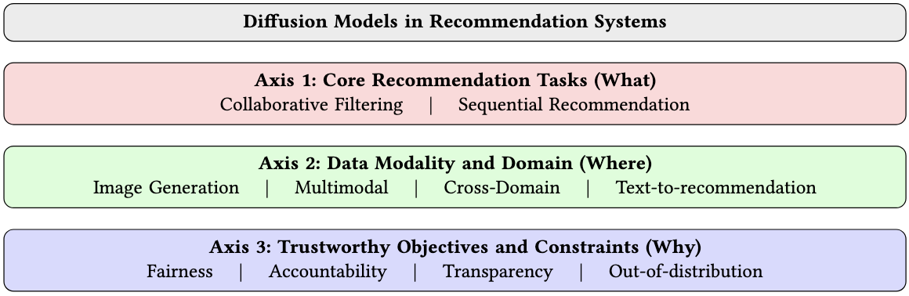
</p>

Detailed information can be found in our [survey paper](https://arxiv.org/pdf/2501.10548).

```Bibtex
@article{wei2025diffusion,
  title={Diffusion Models in Recommendation Systems: A Survey},
  author={Wei, Ting-Ruen and Fang, Yi},
  journal={arXiv preprint arXiv:2501.10548},
  year={2025}
}
```
## Table of Contents
- [Background in Diffusion Models](#background-in-diffusion-models)
- [Papers for Diffusion Models in Recsys](#papers-for-diffusion-models-in-recsys)
  -   [Core Recommendation Tasks](#core-recommendation-tasks)
      -   [Collaborative Filtering](#collaborative-filtering)
          -  [Implicit Feedback](#implicit-feedback)
          -  [Explicit Ratings](#explicit-ratings)
          -  [Item Graph](#item-graph)
          -  [User Graph](#user-graph)
          -  [Knowledge Graph](#knowledge-graph)
      -   [Sequential Recommendation](#sequential-recommendation)
          -  [Point-of-Interest](#point-of-interest)
          -  [Sequence as Diffusion Target and Guidance](#sequence-as-diffusion-target-and-guidance)
          -  [Sequence as Diffusion Target](#sequence-as-diffusion-target)
          -  [Sequence as Diffusion Guidance](#sequence-as-diffusion-guidance)
  -   [Data Modality and Domain](#data-modality-and-domain)
      -  [Image Generation](#image-generation)
      -  [Text-to-Recommendation](#text-to-recommendation)
      -  [Multimodal Recommendation](#multimodal-recommendation)
      -  [Cross-domain Recommendation](#cross-domain-recommendation)
  -   [Trustworthy Objectives and Constraints](#trustworthy-objectives-and-constraints)
      -  [Fairness](#fairness)
      -  [Accountability](#accountability)
      -  [Transparency](#transparency)
      -  [Out-of-Distribution](#out-of-distribution)

---

### Background in Diffusion Models
- [Deep Unsupervised Learning using Nonequilibrium Thermodynamics](https://arxiv.org/abs/1503.03585)
- [Generative Modeling by Estimating Gradients of the Data Distribution](https://arxiv.org/abs/1907.05600)
- [Denoising Diffusion Probabilistic Models](https://arxiv.org/abs/2006.11239)
- [Score-Based Generative Modeling through Stochastic Differential Equations](https://arxiv.org/abs/2011.13456)
- [Improved Denoising Diffusion Probabilistic Models](https://arxiv.org/abs/2102.09672)
- [Diffusion Models Beat GANs on Image Synthesis](https://arxiv.org/abs/2105.05233)
- [Classifier-Free Diffusion Guidance](https://arxiv.org/abs/2207.12598)
- [High-Resolution Image Synthesis with Latent Diffusion Models](https://arxiv.org/abs/2112.10752)
- [Progressive Distillation for Fast Sampling of Diffusion Models](https://arxiv.org/abs/2202.00512)

---

### Papers for Diffusion Models in Recsys

### Core Recommendation Tasks

<p align="center">
  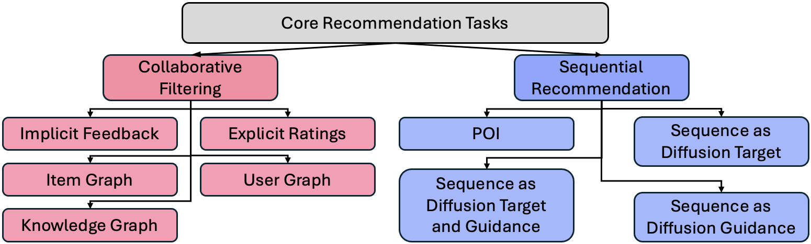
</p>

### Collaborative Filtering

- #### **Implicit Feedback**

|Title | Venue | Main Image | Paper|
| :--- | :--: | :---: | :---: |
|Blurring-sharpening process models for collaborative filtering| SIGIR 2023 |  | [Link](https://arxiv.org/abs/2211.09324)|
|Incorporating Classifier-Free Guidance in Diffusion Model-Based Recommendation | Arxiv 2024 |  | [Link](https://arxiv.org/abs/2409.10494)|
|Collaborative Filtering Based on Diffusion Models: Unveiling the Potential of High-Order Connectivity | SIGIR 2024 |  | [Link](https://arxiv.org/abs/2404.14240)|
|Recommendation via collaborative diffusion generative model | KSEM 2022 | | [Link](https://link.springer.com/chapter/10.1007/978-3-031-10989-8_47)|
|Denoising diffusion recommender model | SIGIR 2024 |  | [Link](https://arxiv.org/abs/2401.06982)|
|A Directional Diffusion Graph Transformer for Recommendation | Arxiv 2024 |  | [Link](https://arxiv.org/abs/2404.03326)|
|Diffusion recommender model | SIGIR 2023 |  | [Link](https://arxiv.org/abs/2304.04971)|
|Recfusion: A binomial diffusion process for 1d data for recommendation | Arxiv 2023 |  | [Link](https://arxiv.org/abs/2306.08947)|
|SCONE: A Novel Stochastic Sampling to Generate Contrastive Views and Hard Negative Samples for Recommendation | WSDM 2025 |  | [Link](https://arxiv.org/abs/2405.00287)|
|Effects of Using Synthetic Data on Deep Recommender Models' Performance | Arxiv 2024 |  | [Link](https://arxiv.org/abs/2406.18286)|
|GDDRec: graph neural diffusion model for diversified recommendation | KIS 2025 |  | [Link](https://link.springer.com/article/10.1007/s10115-025-02348-y)|
|Collaborative Diffusion Model for Recommender System | WWW 2025 |  | [Link](https://arxiv.org/abs/2501.18997)|
|Hyperbolic Diffusion Recommender Model | WWW 2025 |  | [Link](https://arxiv.org/abs/2504.01541)|
|Conditional diffusion model for recommender systems | NN 2025 |  | [Link](https://www.sciencedirect.com/science/article/pii/S0893608025000838)|
|Generative Recommendation with Continuous-Token Diffusion | Arxiv 2025 |  | [Link](https://arxiv.org/abs/2504.12007)|
|Diffusion Model as a Base for Cold Item Recommendation | Applied Sciences 2025 |  | [Link](https://www.mdpi.com/2076-3417/15/9/4784)|
|Diff-GNDCRec: A diffusion model with graph-node enhancement and difference comparison for recommendation | IPM 2025 | | [Link](https://www.sciencedirect.com/science/article/abs/pii/S0306457325000950?dgcid=rss_sd_all)|
|A Diffusion Model with User Preference Guidance for Recommendation | DASFAA 2024 || [Link](https://link.springer.com/chapter/10.1007/978-981-97-5555-4_15)|
|Graph-based Diffusion Model for Collaborative Filtering | Arxiv 2025 |  | [Link](https://arxiv.org/abs/2504.05029)|
|DiffGCL: Diffusion model-based Graph Contrastive Learning for Service Recommendation | ICWS 2024 |  | [Link](https://ieeexplore.ieee.org/document/10707576)|
|Divide-and-Conquer: Cold-Start Bundle Recommendation via Mixture of Diffusion Experts | Arxiv 2025 |  | [Link](https://arxiv.org/abs/2505.05035)|
|DiffGraph: Heterogeneous Graph Diffusion Model | WSDM 2025 |  | [Link](https://arxiv.org/abs/2501.02313)|
|Diffusion-driven SpatioTemporal Graph KANsformer for Medical Examination Recommendation | Arxiv 2025 |  | [Link](https://arxiv.org/abs/2505.07431)|
|DiffGR: A Discrete Diffusion-Based Model for Personalised Recommendation by Reconstructing User-Item Bipartite Graphs | ECIR 2025 | | [Link](https://link.springer.com/chapter/10.1007/978-3-031-88714-7_23)|
|GGDHSCL: A Graph Generative Diffusion With Hard Negative Sampling Contrastive Learning Recommendation Method | TCSS 2025 |  | [Link](https://ieeexplore.ieee.org/document/10904007)|
|Personalized Diffusion Model Reshapes Cold-Start Bundle Recommendation | WWW 2025 |  | [Link](https://arxiv.org/abs/2505.14901)|
|Addressing Cold-Start Problem in Click-Through Rate Prediction via Supervised Diffusion Modeling | AAAI 2025 |  | [Link](https://arxiv.org/abs/2504.06270)|
|Interest-Aware Graph Contrastive Learning for Recommendation with Diffusion-based Augmentation | TKDE 2025 |  | [Link](https://ieeexplore.ieee.org/abstract/document/11202202)|
|Modeling Item-Level Dynamic Variability with Residual Diffusion for Bundle Recommendation | AAAI 2026 |  | [Link](https://arxiv.org/pdf/2507.03280)|
|GDiffMAE: Guided Diffusion Enhanced Mask Graph AutoEncoder for Recommendation | TKDE 2025 |  | [Link](https://ieeexplore.ieee.org/stamp/stamp.jsp?tp=&arnumber=11168178)|
|DiffMSR: a Multi-Semantic Graph Diffusion Model for Service Recommendation | TSC 2025 |  | [Link](https://ieeexplore.ieee.org/stamp/stamp.jsp?tp=&arnumber=11119790)|
|Hierarchical graph contrastive learning with diffusion-enhanced for multi-behavior recommendation | IPM 2026 |  | [Link](https://www.sciencedirect.com/science/article/abs/pii/S0306457325003887)|
|Dual-view collaboration fusion on diffusion learning for bundle recommendation | Info Fusion 2025 | | [Link](https://www.sciencedirect.com/science/article/abs/pii/S1566253525002271)|
|Diffusion-Augmented Hierarchical Graph Convolutional Network for Multi-behavior Recommendation | ADMA 2025 |  | [Link](https://link.springer.com/chapter/10.1007/978-981-95-3462-3_31)|
|DGenCTR: Towards a Universal Generative Paradigm for Click-Through Rate Prediction via Discrete Diffusion | Arvix 2025 |  | [Link](https://arxiv.org/pdf/2508.14500)|
|Fading to Grow: Growing Preference Ratios via Preference Fading Discrete Diffusion for Recommendation | NeurIPS 2025 |  | [Link](https://arxiv.org/pdf/2509.26063)|
|HierDiffuse: Progressive Diffusion for Robust Interest Fusion in CTR Prediction | EMNLP 2025 |  | [Link](https://aclanthology.org/2025.emnlp-industry.92.pdf)|
|ConDiff: Conditional graph diffusion model for recommendation | IPM 2026 |  | [Link](https://www.sciencedirect.com/science/article/pii/S0306457325002444)|
|Causal variational inference for deconfounded multi-behavior recommendation | TOIS 2025 |  | [Link](https://dl.acm.org/doi/full/10.1145/3745023)|

- #### **Explicit Ratings**
  
|Title | Venue | Main Image | Paper|
| :--- | :--: | :---: | :---: |
|DGRM: Diffusion-GAN recommendation model to alleviate the mode collapse problem in sparse environments | Pattern Recognition 2024 | | [Link](https://www.sciencedirect.com/science/article/abs/pii/S0031320324004436)|
|EDGE-Rec: Efficient and Data-Guided Edge Diffusion For Recommender Systems Graphs | Arxiv 2024 | | [Link](https://arxiv.org/abs/2409.14689)|
|Differentially Private Recommendation Algorithm based on Diffusion Model and Rényi Similarity | Info Sci 2025 | | [Link](https://www.sciencedirect.com/science/article/abs/pii/S002002552500698X)|

- #### **Item Graph**

|Title | Venue | Main Image | Paper|
| :--- | :--: | :---: | :---: |
|DICES: Diffusion-Based Contrastive Learning with Knowledge Graphs for Recommendation | KSEM 2024 | | [Link](https://link.springer.com/chapter/10.1007/978-981-97-5495-3_9)|
|G-Diff: A Graph-Based Decoding Network for Diffusion Recommender Model | TNNLS 2024 |  | [Link](https://ieeexplore.ieee.org/document/10750895)|
|Graph Signal Diffusion Model for Collaborative Filtering | SIGIR 2024 | | [Link](https://arxiv.org/abs/2311.08744)|
|Disentangled Contrastive Bundle Recommendation with Conditional Diffusion | AAAI 2025 | | [Link](https://ojs.aaai.org/index.php/AAAI/article/view/33314)|

- #### **User Graph**

|Title | Venue | Main Image | Paper|
| :--- | :--: | :---: | :---: |
|Diffusion social augmentation for social recommendation | Supercomputing 2025 | | [Link](https://link.springer.com/article/10.1007/s11227-024-06695-5)|
|Recdiff: diffusion model for social recommendation | CIKM 2024 | | [Link](https://arxiv.org/abs/2406.01629)|
|Score-based generative diffusion models for social recommendations | Arvix 2024 | | [Link](https://arxiv.org/abs/2412.15579)|
|Graph diffusive self-supervised learning for social recommendation | SIGIR 2024 | | [Link](https://dl.acm.org/doi/10.1145/3626772.3657962)|
|Dual Graph Denoising Model for Social Recommendation | WWW 2025 | | [Link](https://dl.acm.org/doi/10.1145/3696410.3714874)|
|Model-Agnostic Social Network Refinement with Diffusion Models for Robust Social Recommendation | WWW 2025 | | [Link](https://dl.acm.org/doi/10.1145/3696410.3714683)|
|A Feature-Weighted Attention Diffusion Model for Social Recommendation | DDCLS 2025 | | [Link](https://ieeexplore.ieee.org/stamp/stamp.jsp?tp=&arnumber=11065590)|
|Graph Diffusion Social Recommendation | TCE 2025 | | [Link](https://ieeexplore.ieee.org/stamp/stamp.jsp?tp=&arnumber=11099088)|

- #### **Knowledge Graph**

|Title | Venue | Main Image | Paper|
| :--- | :--: | :---: | :---: |
|Diffkg: Knowledge graph diffusion model for recommendation | WSDM 2024 | | [Link](https://arxiv.org/abs/2312.16890)|
|RsDiff: Rational Score baesd Knowledge Graph Diffusion for Recommendation | Info Sci 2025 || [Link](https://www.sciencedirect.com/science/article/abs/pii/S0020025525004244)|
|DAGR: DyHGSampler and AdaSGC-Based Knowledge Graph Diffusion for Recommendation | ICIC 2025 | | [Link](https://link.springer.com/chapter/10.1007/978-981-96-9881-3_11)|
|TCM-DiffPR: knowledge graph diffusion model for personalized traditional Chinese medicine recommendation | JIIS 2025 |  | [Link](https://link.springer.com/article/10.1007/s10844-025-00994-w)|
|DKGM: A diffusion knowledge graph model for medication recommendation leveraging medical and drug information | ICHI 2025 |  | [Link](https://ieeexplore.ieee.org/stamp/stamp.jsp?tp=&arnumber=11081566)|
|Mask diffusion-based contrastive learning for knowledge-aware recommendation | TKDE 2025 |  | [Link](https://ieeexplore.ieee.org/stamp/stamp.jsp?tp=&arnumber=11049045)|
|Knowledge-aware Diffusion-Enhanced Multimedia Recommendation | Multimedia 2025 |  | [Link](https://ieeexplore.ieee.org/stamp/stamp.jsp?tp=&arnumber=11175523)|

---

### Sequential Recommendation

- #### **Point-of-interest**

|Title | Venue | Main Image | Paper|
| :--- | :--: | :---: | :---: |
|Diffusion-based cloud-edge-device collaborative learning for next POI recommendations | KDD 2024 |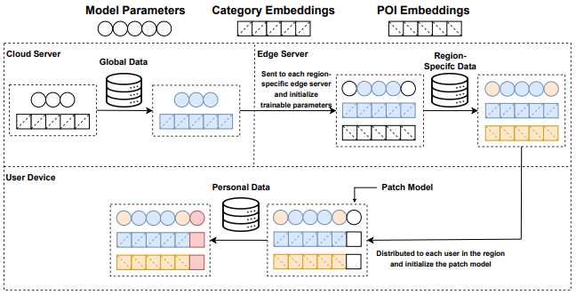| [Link](https://arxiv.org/abs/2405.13811)|
|Diff-DGMN: A Diffusion-Based Dual Graph Multi-Attention Network for POI Recommendation | IoT 2024 |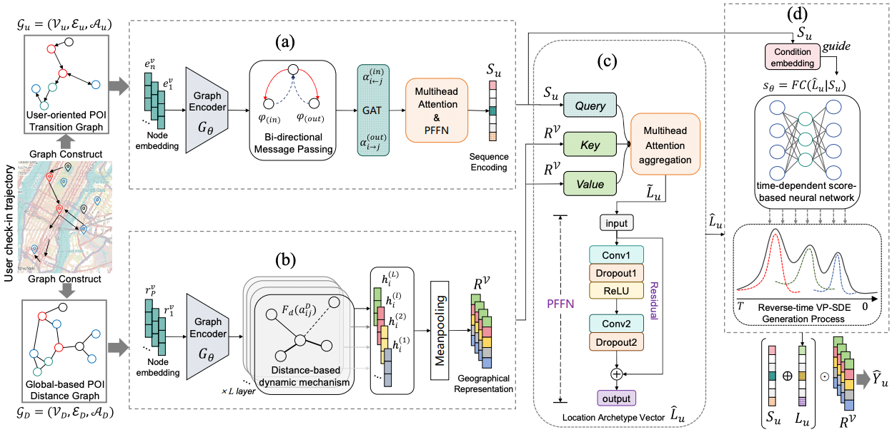| [Link](https://ieeexplore.ieee.org/document/10640103)|
|A diffusion model for poi recommendation | TOIS 2023 |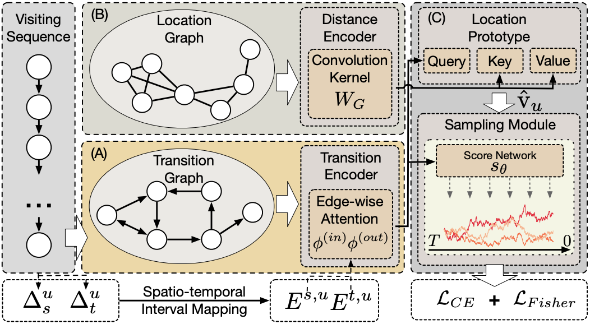| [Link](https://arxiv.org/abs/2304.07041)|
|DSDRec: Next POI recommendation using deep semantic extraction and diffusion model | Info Sci 2024 || [Link](https://www.sciencedirect.com/science/article/abs/pii/S0020025524009186)|
|HGDRec: Next poi recommendation based on hypergraph neural network and diffusion model | TSC 2025 |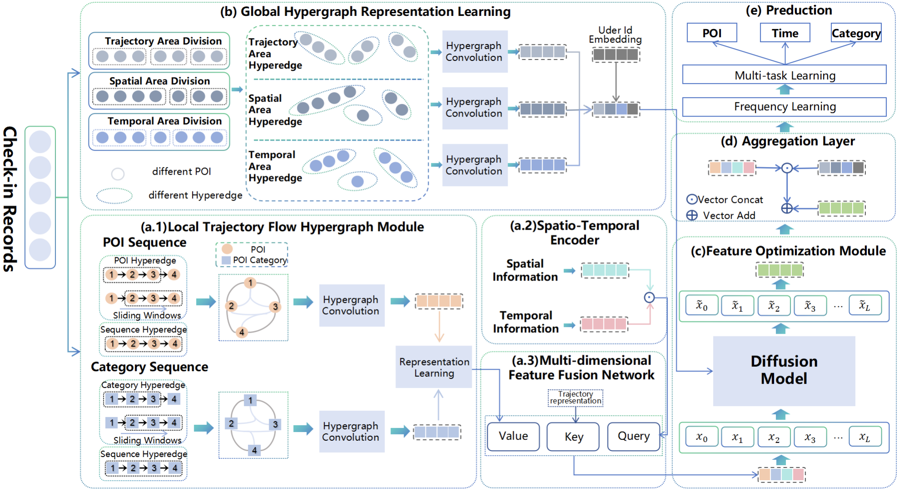| [Link](https://ieeexplore.ieee.org/abstract/document/10969795)|
|DMSDRec: Dynamic Structure-aware Graph Masked Autoencoder and Spatiotemporal Diffusion for Next-POI Recommendation | TSC 2025 |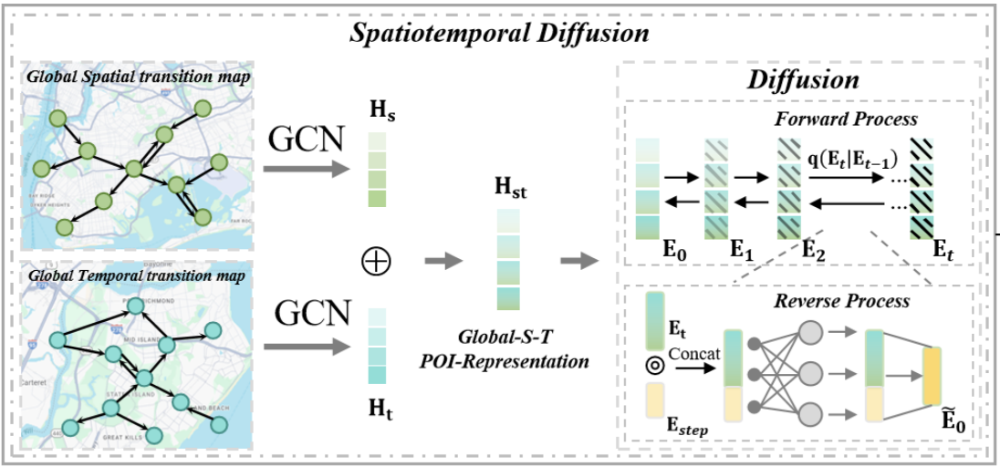| [Link](https://ieeexplore.ieee.org/stamp/stamp.jsp?tp=&arnumber=11006010)|
|Bridging User Dynamic Preferences: A Unified Bridge-based Diffusion Model for Next POI Recommendation | Big Data 2025 |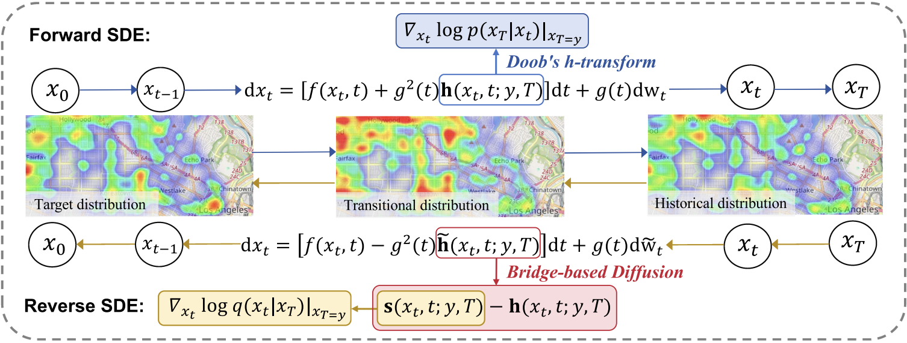| [Link](https://ieeexplore.ieee.org/stamp/stamp.jsp?tp=&arnumber=11195170)|

- #### **Sequence as Diffusion Target and Guidance**
  
|Title | Venue | Main Image | Paper|
| :--- | :--: | :---: | :---: |
|Context Matters: Enhancing Sequential Recommendation with Context-aware Diffusion-based Contrastive Learning | CIKM 2024 || [Link](https://arxiv.org/abs/2405.09369)|
|Dual Conditional Diffusion Models for Sequential Recommendation | Arxiv 2024 || [Link](https://arxiv.org/abs/2410.21967)|
|Semantic-Aware Diffusion Model for Sequential Recommendation | Open Review 2024 || [Link](https://openreview.net/forum?id=2E6OK8cSoB)|
|Diffusion Model for Interest Refinement in Multi-Interest Recommendation | Arxiv 2025 || [Link](https://arxiv.org/abs/2502.05561)|
|Unlocking the Power of Diffusion Models in Sequential Recommendation: A Simple and Effective Approach | Arxiv 2025 || [Link](https://arxiv.org/abs/2505.19544)|
|Enhancing Sequential Recommendation with Global Diffusion | AAAI 2025 || [Link](https://ojs.aaai.org/index.php/AAAI/article/view/33341)|
|Intent-aware Diffusion with Contrastive Learning for Sequential Recommendation | SIGIR 2025 || [Link](https://arxiv.org/abs/2504.16077)|
|Diffusion augmentation for sequential recommendation | CIKM 2023 |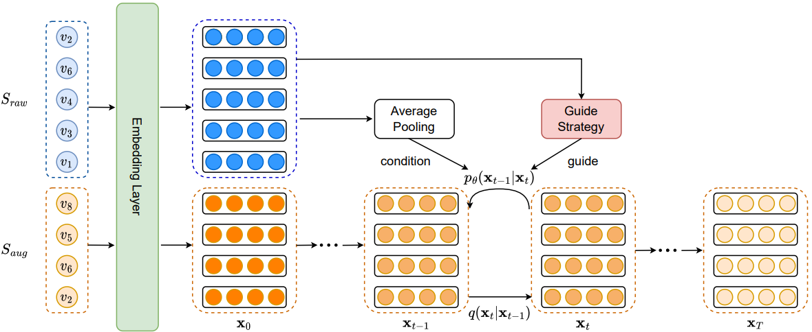| [Link](https://arxiv.org/abs/2309.12858)|
|Energy-Guided Diffusion Sampling for Long-Term User Behavior Prediction in Reinforcement Learning-based Recommendation | CIKM 2025 || [Link](https://dl.acm.org/doi/epdf/10.1145/3746252.3761076)|
|DMMD4SR: Diffusion Model-based Multi-level Multimodal Denoising for Sequential Recommendation | MM 2025 || [Link](https://dl.acm.org/doi/epdf/10.1145/3746027.3755861)|
|Multi-Modal Multi-Behavior Sequential Recommendation with Conditional Diffusion-Based Feature Denoising | SIGIR 2025 || [Link](https://dl.acm.org/doi/epdf/10.1145/3726302.3730044)|

- #### **Sequence as Diffusion Target**

|Title | Venue | Main Image | Paper|
| :--- | :--: | :---: | :---: |
|Discrete conditional diffusion for reranking in recommendation | WWW 2024 |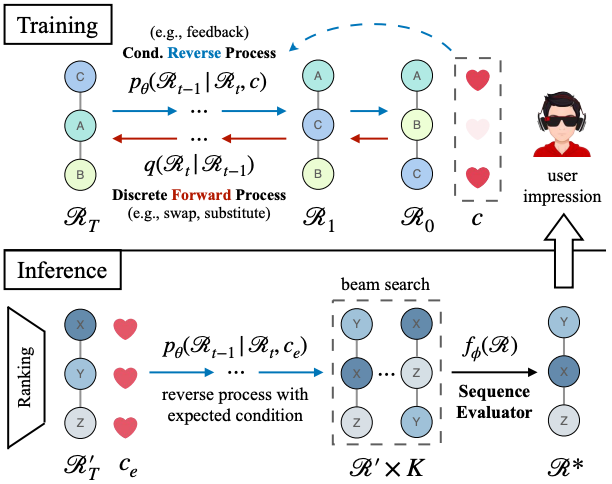| [Link](https://dl.acm.org/doi/10.1145/3589335.3648313)|
|Breaking Determinism: Fuzzy Modeling of Sequential Recommendation Using Discrete State Space Diffusion Model | NeurIPS 2024 |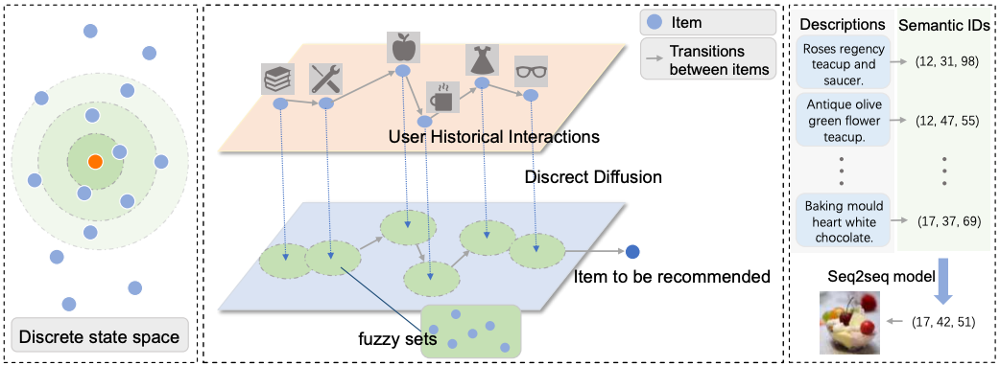| [Link](https://arxiv.org/abs/2410.23994)|
|A Diffusion Data Enhancement Retentive Model for Sequential Recommendation | CISAT 2024 |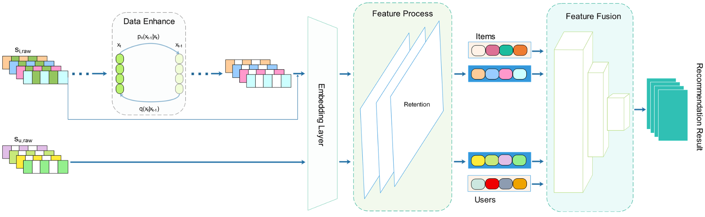| [Link](https://ieeexplore.ieee.org/abstract/document/10695308)|
|Diff4rec: Sequential recommendation with curriculum-scheduled diffusion augmentation | MM 2023 |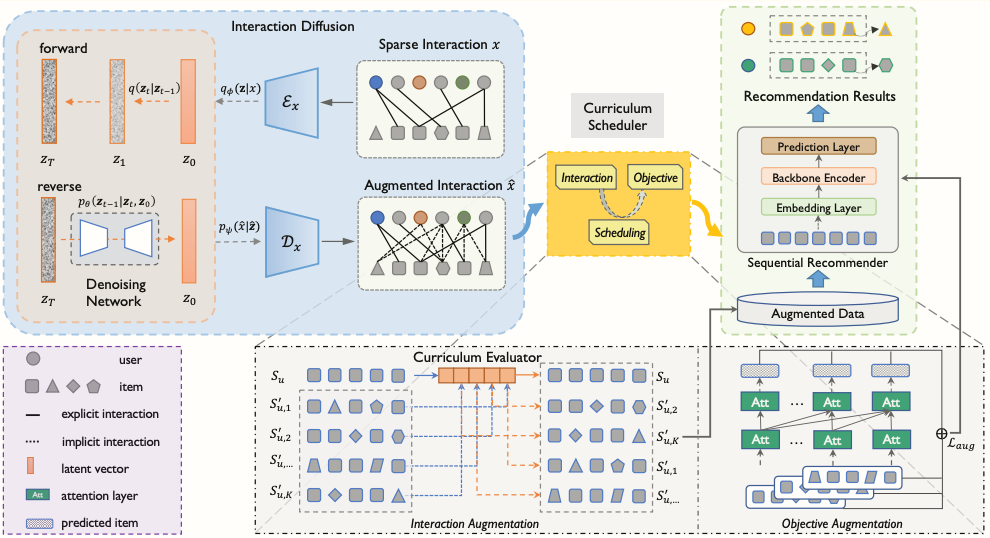| [Link](https://dl.acm.org/doi/10.1145/3581783.3612709)|
|Multi-Interest Network with Simple Diffusion for Multi-Behavior Sequential Recommendation | SDM 2024 |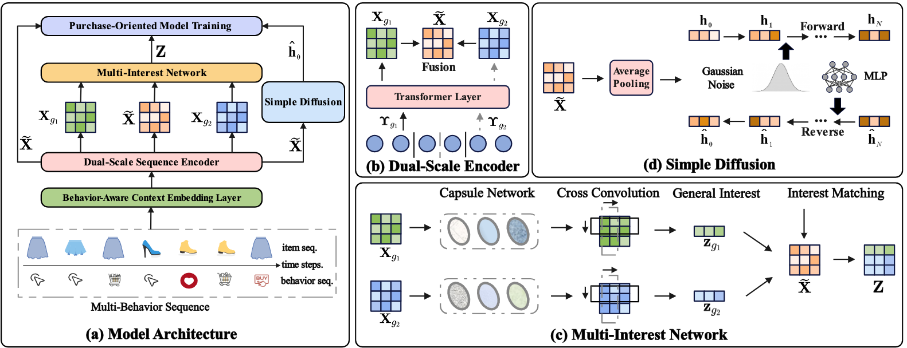| [Link](https://epubs.siam.org/doi/10.1137/1.9781611978032.84)|
|Plug-in diffusion model for sequential recommendation | AAAI 2024 |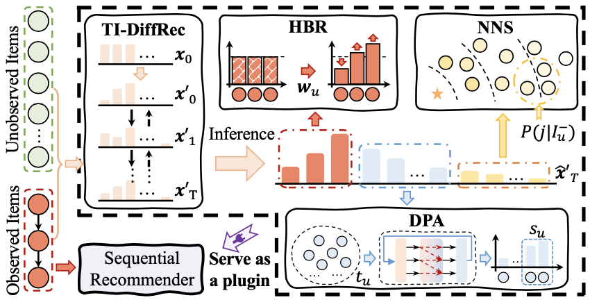| [Link](https://arxiv.org/abs/2401.02913)|
|SeeDRec: Sememe-based Diffusion for Sequential Recommendation | IJCAI 2024 |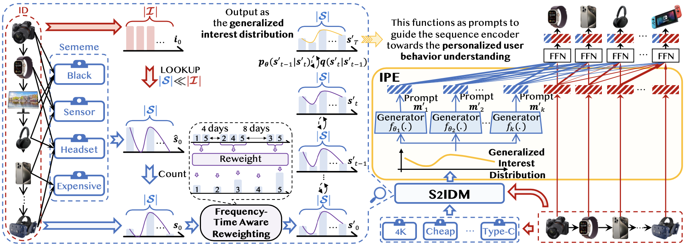| [Link](https://www.ijcai.org/proceedings/2024/251)|
|Bridging User Dynamics: Transforming Sequential Recommendations with Schr{\"o}dinger Bridge and Diffusion Models | CIKM 2024 |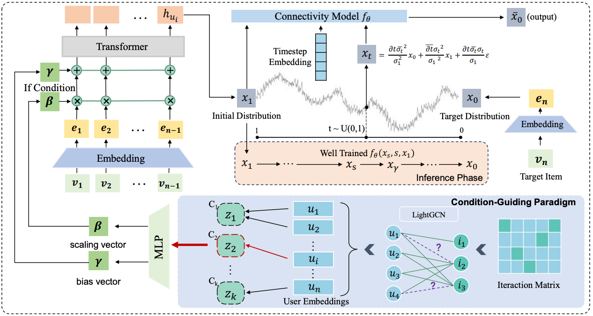| [Link](https://arxiv.org/abs/2409.10522)|
|Context-Aware Diffusion-based Sequential Recommendation | BigData 2024 |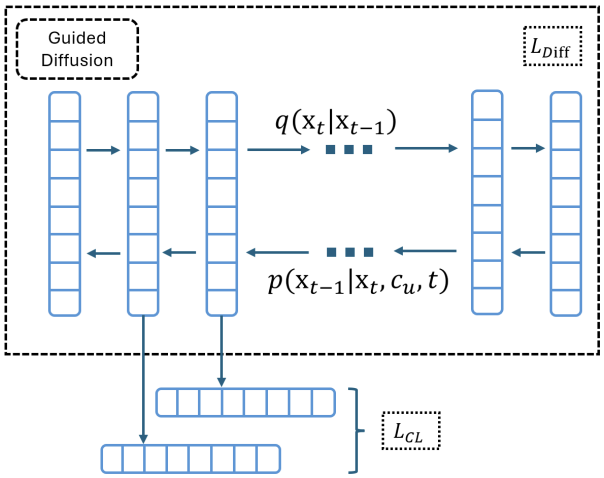| [Link](https://ieeexplore.ieee.org/document/10826051)|
|DiffGCA: A Diffusion Recommendation Model with Global Attention Mechanism | DSIT 2025 |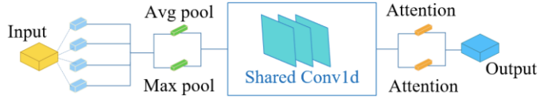| [Link](https://ieeexplore.ieee.org/document/10880988)|
|When Feature Encoder Meets Diffusion Model for Sequential Recommendations | Info Sci 2025 || [Link](https://www.sciencedirect.com/science/article/abs/pii/S0020025525000350)|
|EDiffuRec: An Enhanced Diffusion Model for Sequential Recommendation | Mathematics 2024 |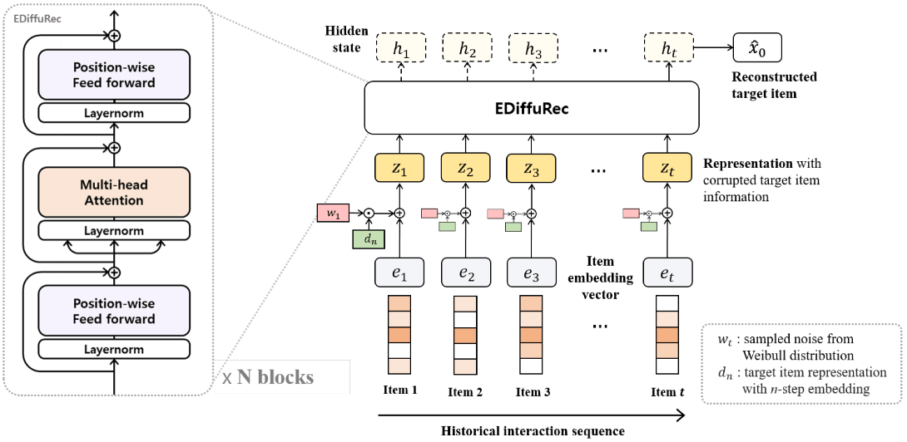| [Link](https://www.mdpi.com/2227-7390/12/12/1795)|
|Similarity-Guided Diffusion for Contrastive Sequential Recommendation | Arxiv 2025 |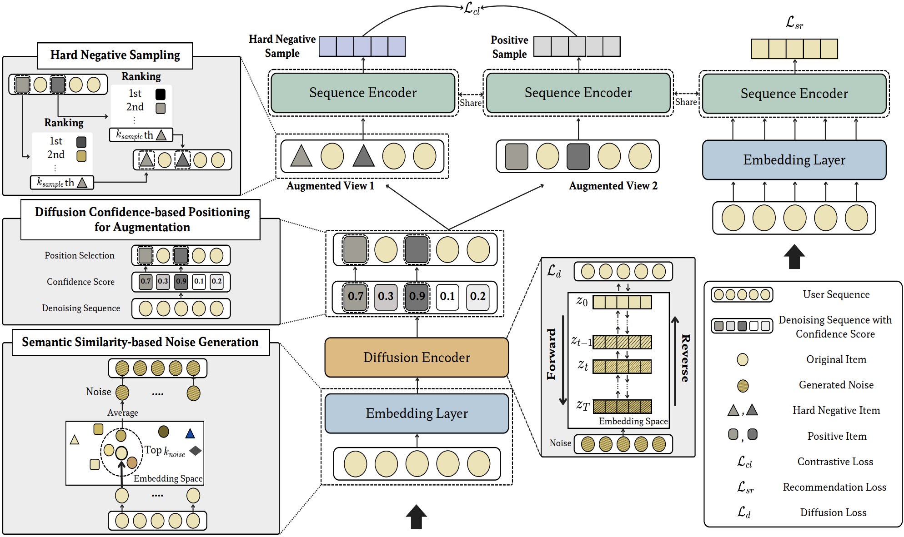| [Link](https://arxiv.org/pdf/2507.11866)|
|DiffusionGS: Generative Search with Query Conditioned Diffusion in Kuaishou | Arxiv 2025 |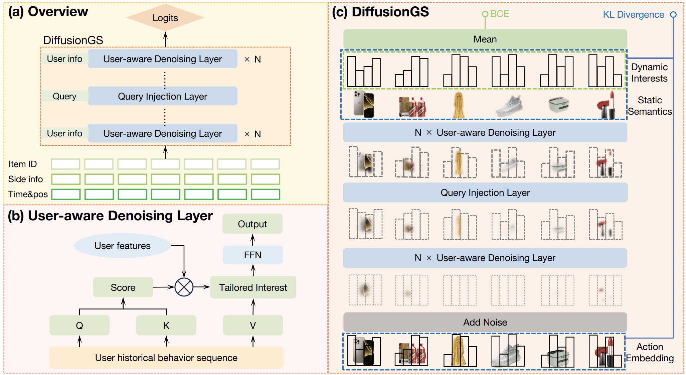| [Link](https://arxiv.org/pdf/2508.17754)|
|Fusion of diffusion models and intent learning in sequential recommendation | JIIS 2025 |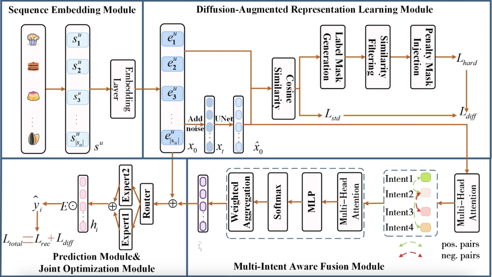| [Link](https://link.springer.com/article/10.1007/s10844-025-00986-w)|
|Modeling Long-term User Behaviors with Diffusion-driven Multi-interest Network for CTR Prediction | RecSys 2025 |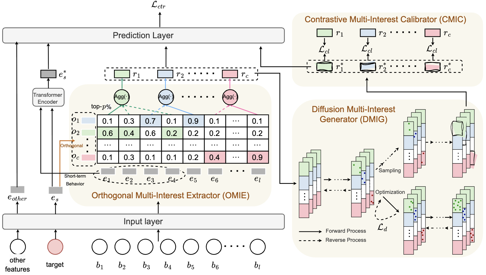| [Link](https://dl.acm.org/doi/epdf/10.1145/3705328.3748045)|
|Time-Weighted Diffusion Model for Enhanced Sequential Recommendations | DDCLS 2025 || [Link](https://ieeexplore.ieee.org/stamp/stamp.jsp?tp=&arnumber=11065965)|
|Unconditional Diffusion for Generative Sequential Recommendation | Arxiv 2025 |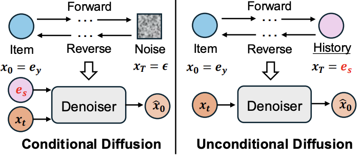| [Link](https://arxiv.org/pdf/2507.06121)|
|Adaptive User Interest Modeling via Conditioned Denoising Diffusion For Click-Through Rate Prediction | Arxiv 2025 |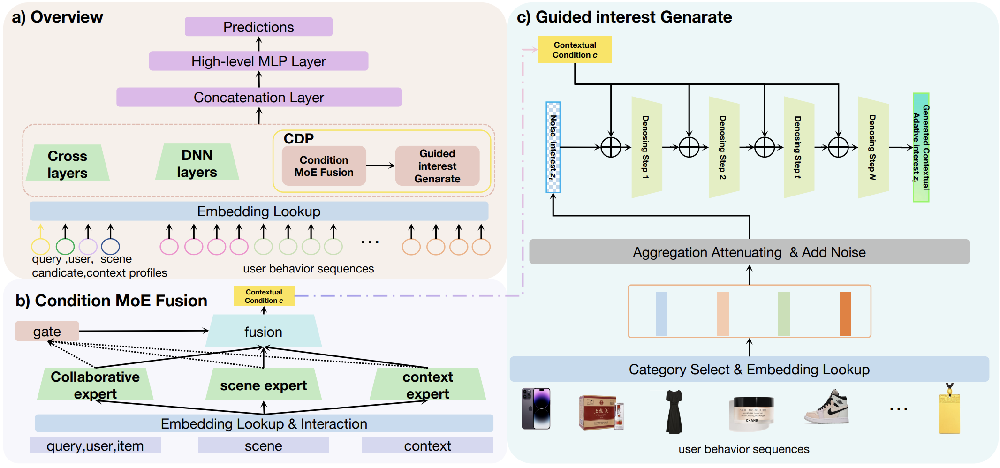| [Link](https://arxiv.org/pdf/2509.19876)|
|DiffSBR: A diffusion model for session-based recommendation | IPM 2026 | | [Link](https://www.sciencedirect.com/science/article/pii/S0306457325002250)|
|Multi-source information diffusion model for conversation recommender system | Evolving Systems 2025 |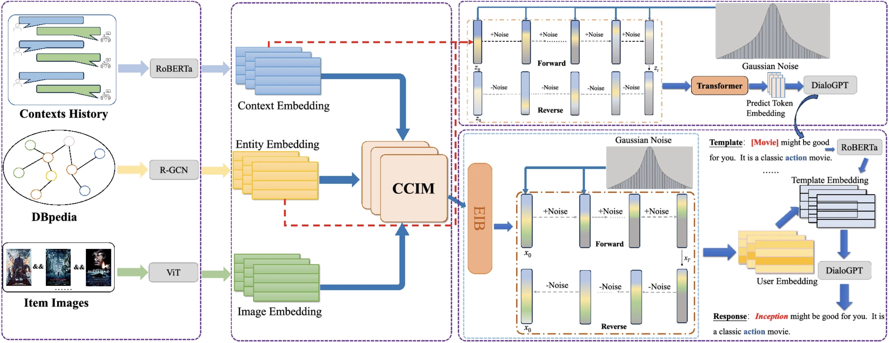| [Link](https://link.springer.com/article/10.1007/s12530-025-09692-y)|

- #### **Sequence as Diffusion Guidance**

|Title | Venue | Main Image | Paper|
| :--- | :--: | :---: | :---: |
|Conditional denoising diffusion for sequential recommendation | PAKDD 2024 |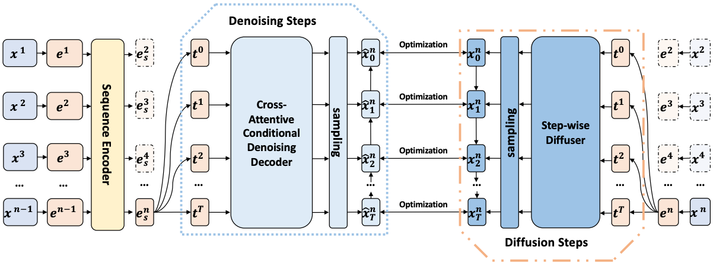| [Link](https://arxiv.org/abs/2304.11433)|
|Sequential recommendation with diffusion models | Arxiv 2023 |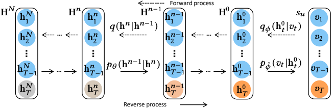| [Link](https://arxiv.org/abs/2304.04541)|
|Diffusion Recommendation with Implicit Sequence Influence | WWW 2024 |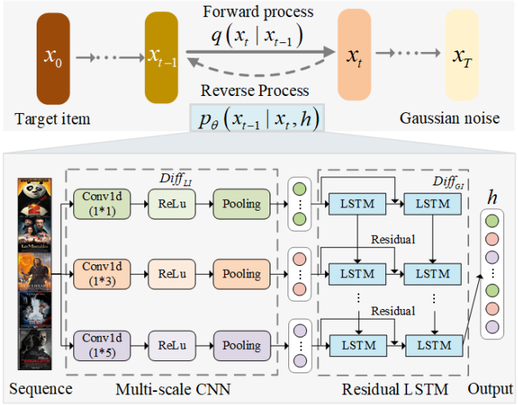| [Link](https://dl.acm.org/doi/10.1145/3589335.3651951)|
|Diffurec: A diffusion model for sequential recommendation | TOIS 2023 |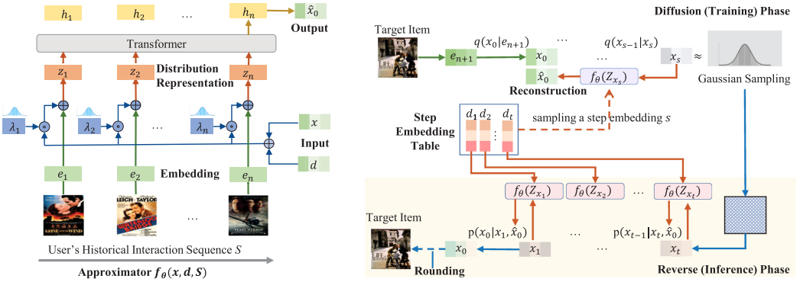| [Link](https://dl.acm.org/doi/10.1145/3631116)|
|DimeRec: A Unified Framework for Enhanced Sequential Recommendation via Generative Diffusion Models | WSDM 2025 |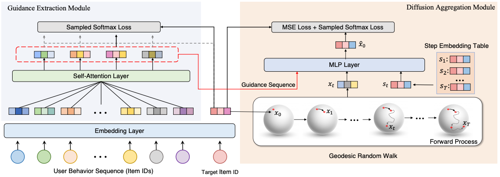| [Link](https://arxiv.org/abs/2408.12153)|
|Generate what you prefer: Reshaping sequential recommendation via guided diffusion | NeurIPS 2024 |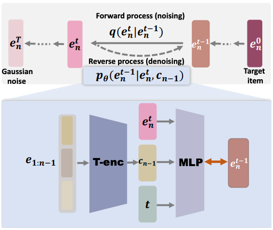| [Link](https://arxiv.org/abs/2310.20453)|
|Generate and Instantiate What You Prefer: Text-Guided Diffusion for Sequential Recommendation | Arxiv 2024 |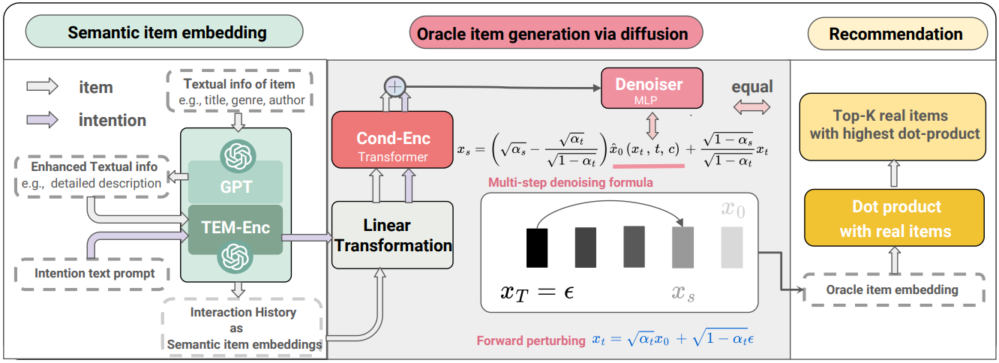| [Link](https://arxiv.org/abs/2410.13428)|
|Implicit local-global feature extraction for diffusion sequence recommendation | EAAI 2025 || [Link](https://www.sciencedirect.com/science/article/abs/pii/S0952197624016294)|
|LeadRec: Towards Personalized Sequential Recommendation via Guided Diffusion | ICIC 2024 || [Link](https://link.springer.com/chapter/10.1007/978-981-97-5618-6_1)|
|Preference Diffusion for Recommendation | Arxiv 2024 |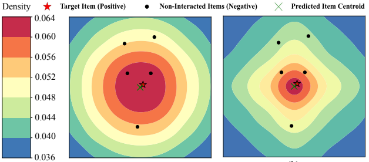| [Link](https://arxiv.org/abs/2410.13117)|
|Generative Diffusion Models for Sequential Recommendations | Recsys 2024 |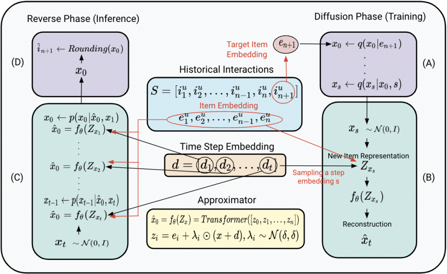| [Link](https://arxiv.org/abs/2410.19429)|
|Learning Multiple User Distributions for Recommendation via Guided Conditional Diffusion | AAAI 2025 |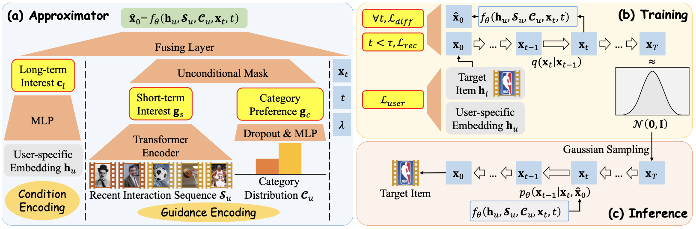| [Link](https://ojs.aaai.org/index.php/AAAI/article/view/33401)|
|Unleashing the Potential of Two-Tower Models: Diffusion-Based Cross-Interaction for Large-Scale Matching | WWW 2025 |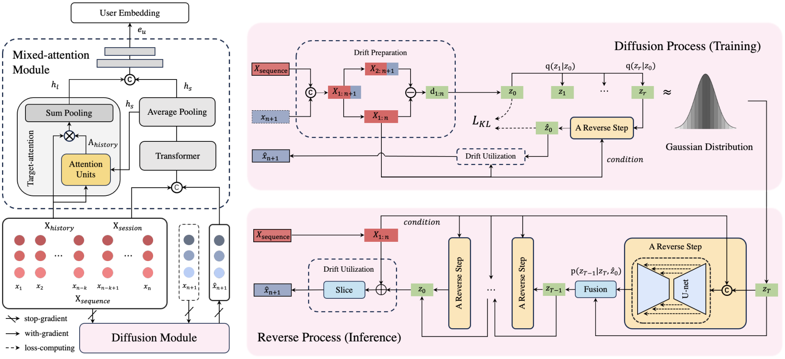| [Link](https://arxiv.org/abs/2502.20687)|
|Distinguished quantized guidance for diffusion-based sequence recommendation | WWW 2025 |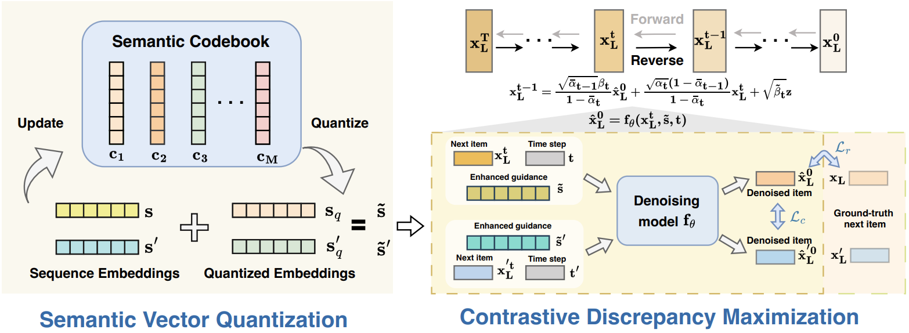| [Link](https://arxiv.org/abs/2501.17670)|
|Addressing Missing Data Issue for Diffusion-based Recommendation | Arxiv 2025 |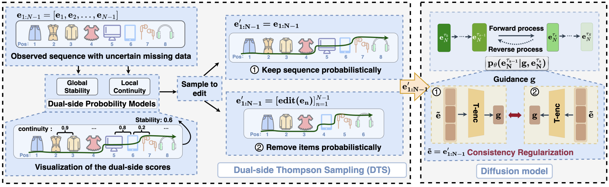| [Link](https://arxiv.org/abs/2505.12283)|
|Enhancing Diffusion Model with Auxiliary Information Mining-Exploration and Efficient Sampling Mechanism for Sequential Recommendation | AAAI 2025 |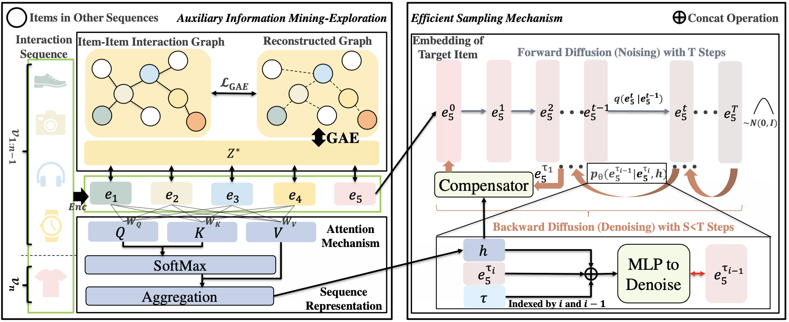| [Link](https://ojs.aaai.org/index.php/AAAI/article/view/33370)|
|Why Generate When You Can Transform? Unleashing Generative Attention for Dynamic Recommendation | MM 2025 |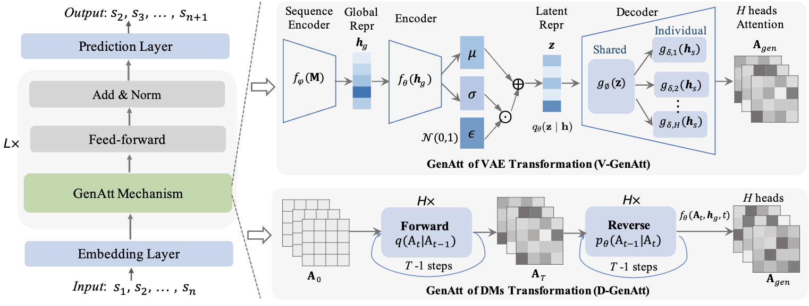| [Link](https://dl.acm.org/doi/epdf/10.1145/3746027.3754564)|
|Adaptive User Dynamic Interest Guidance for Generative Sequential Recommendation | SIGIR 2025 |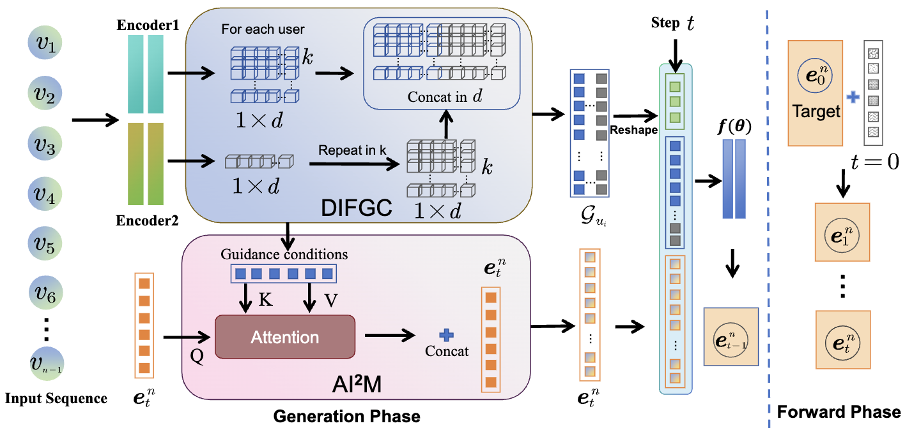| [Link](https://dl.acm.org/doi/epdf/10.1145/3726302.3729888)|
|On Efficiency-Effectiveness Trade-off of Diffusion-based Recommenders | NeurIPS 2025 |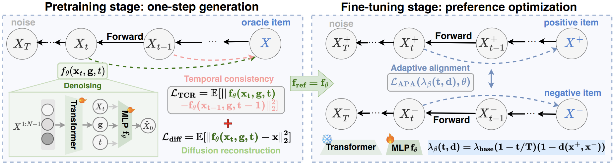| [Link](https://arxiv.org/pdf/2510.17245)|
|Unleashing the potential of diffusion models towards diversified sequential recommendations | SIGIR 2025 |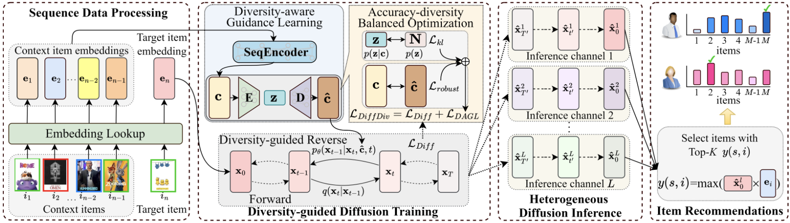| [Link](https://dl.acm.org/doi/epdf/10.1145/3726302.3730109)|

---

### Data Modality and Domain

<p align="center">
  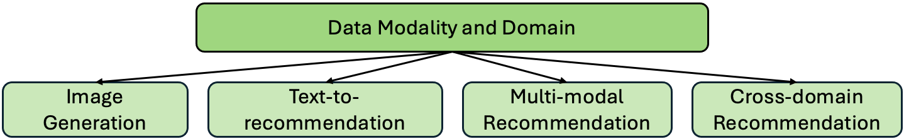
</p>

- #### **Image Generation**

|Title | Venue | Main Image | Paper|
| :--- | :--: | :---: | :---: |
|AdBooster: Personalized Ad Creative Generation using Stable Diffusion Outpainting | Recsys 2023 || [Link](https://arxiv.org/abs/2309.11507)|
|A New Creative Generation Pipeline for Click-Through Rate with Stable Diffusion Model | WWW 2024 || [Link](https://arxiv.org/abs/2401.10934)|
|Dynamic Product Image Generation and Recommendation at Scale for Personalized E-commerce | Recsys 2024 || [Link](https://arxiv.org/abs/2408.12392)|
|Diffusion Models for Generative Outfit Recommendation | SIGIR 2024 || [Link](https://arxiv.org/abs/2402.17279)|
|GEMRec: Towards Generative Model Recommendation | WSDM 2024 || [Link](https://arxiv.org/abs/2308.02205)|
|Recommendations Beyond Catalogs: Diffusion Models for Personalized Generation | Arxiv 2025 || [Link](https://arxiv.org/abs/2502.18477)|
|CTR-Driven Advertising Image Generation with Multimodal Large Language Models | WWW 2025 || [Link](https://dl.acm.org/doi/epdf/10.1145/3696410.3714836)|
|Virtualmodel: Generating object-id-retentive human-object interaction image by diffusion model for e-commerce marketing | Arxiv 2024 || [Link](https://arxiv.org/pdf/2405.09985)|
|Planning and rendering: Towards product poster generation with diffusion models | Arxiv 2023 || [Link](https://arxiv.org/pdf/2312.08822)|
|Sell It Before You Make It: Revolutionizing E-Commerce with Personalized AI-Generated Items | KDD 2026 || [Link](https://arxiv.org/pdf/2503.22182)|
|Chaining text-to-image and large language model: A novel approach for generating personalized e-commerce banners | KDD 2024 || [Link](https://dl.acm.org/doi/epdf/10.1145/3637528.3671636)|
|Personalized image generation with large multimodal models | WWW 2025 || [Link](https://dl.acm.org/doi/epdf/10.1145/3696410.3714843)|
|RAGAR: Retrieval Augment Personalized Image Generation Guided by Recommendation | Arxiv 2025 || [Link](https://arxiv.org/pdf/2505.01657)|
|MMCRec: Towards Multi-modal Generative AI in Conversational Recommendation | ECIR 2024 || [Link](https://link.springer.com/chapter/10.1007/978-3-031-56063-7_23)|
|Pmg: Personalized multimodal generation with large language models | WWW 2024 || [Link](https://dl.acm.org/doi/epdf/10.1145/3589334.3645633)|
|Generative recommendation: Towards next-generation recommender paradigm | Arxiv 2023 || [Link](https://arxiv.org/pdf/2304.03516)|
|Cross-Cultural Fashion Design via Interactive Large Language Models and Diffusion Models | Arxiv 2025 || [Link](https://arxiv.org/pdf/2501.15571)|

- #### **Text-to-recommendation**

|Title | Venue | Main Image | Paper|
| :--- | :--: | :---: | :---: |
|Diffusion Model for Slate Recommendation | Arxiv 2024 || [Link](https://arxiv.org/abs/2408.06883)|

- #### **Multimodal Recommendation**

|Title | Venue | Main Image | Paper|
| :--- | :--: | :---: | :---: |
|DiffMM: Multi-Modal Diffusion Model for Recommendation | MM 2024 |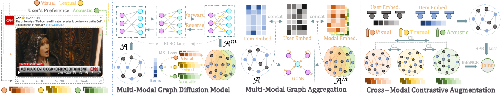| [Link](https://arxiv.org/abs/2406.11781)|
|LD4MRec: Simplifying and Powering Diffusion Model for Multimedia Recommendation | Arxiv 2023 |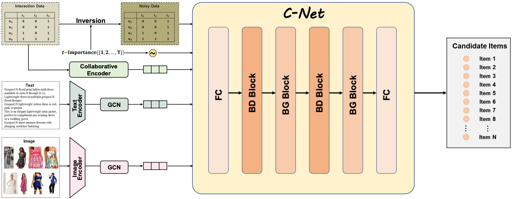| [Link](https://arxiv.org/abs/2309.15363)|
|Multimodal Conditioned Diffusion Model for Recommendation | WWW 2024 |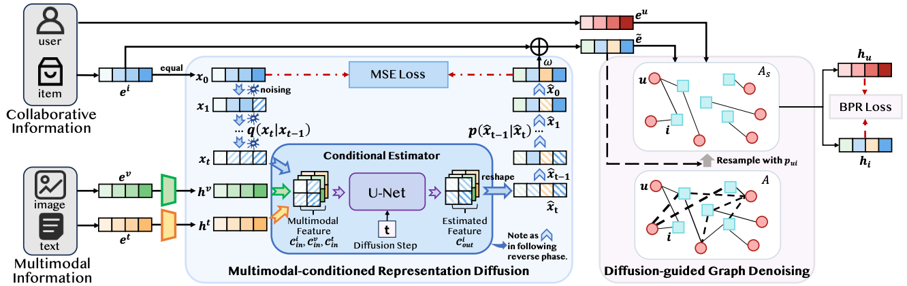| [Link](https://dl.acm.org/doi/10.1145/3589335.3651956)|
|Diffusion Review-Based Recommendation | KSEM 2024 || [Link](https://link.springer.com/chapter/10.1007/978-981-97-5489-2_23)|
|DiffCL: A Diffusion-Based Contrastive Learning Framework with Semantic Alignment for Multimodal Recommendations | Arxiv 2025 |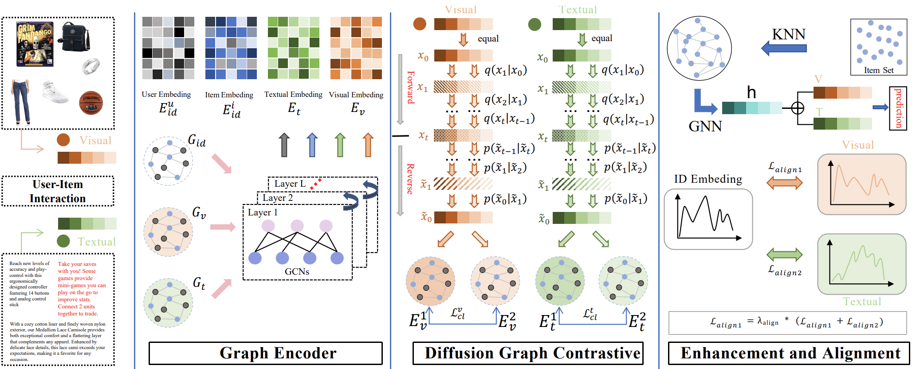| [Link](https://arxiv.org/abs/2501.01066)|
|Curriculum Conditioned Diffusion for Multimodal Recommendation | AAAI 2025 |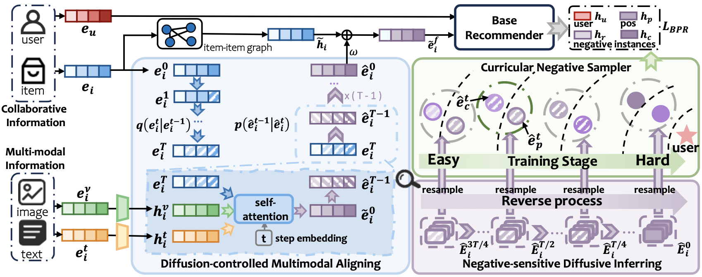| [Link](https://ojs.aaai.org/index.php/AAAI/article/view/33422)|
|DiffKD: collaborative graph diffusion with knowledge distillation for multimodal recommendation | JIIS 2025 |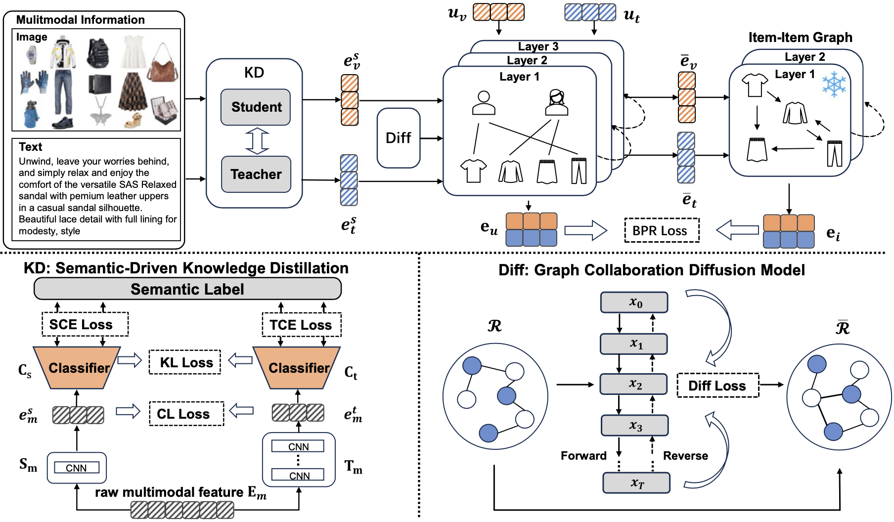| [Link](https://arxiv.org/abs/2406.11781)|
|ITCoHD-MRec: An Independent Topological Preference Aware and Cooperative Hypergraph Diffusion based Multimodal Recommender Model | TOIS 2025 |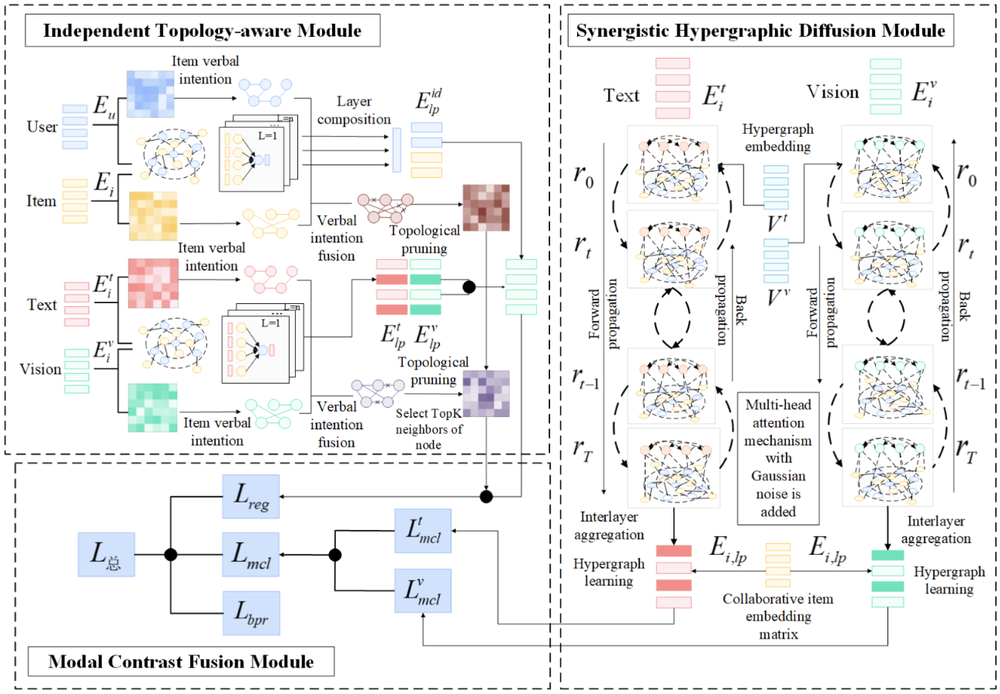| [Link](https://dl.acm.org/doi/epdf/10.1145/3767337)|
|MDSBR: Multimodal Denoising for Session-based Recommendation | RecSys 2025 |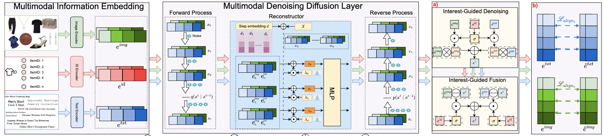| [Link](https://dl.acm.org/doi/epdf/10.1145/3705328.3748061)|
|Generating Difficulty-aware Negative Samples via Conditional Diffusion for Multi-modal Recommendation | SIGIR 2025 |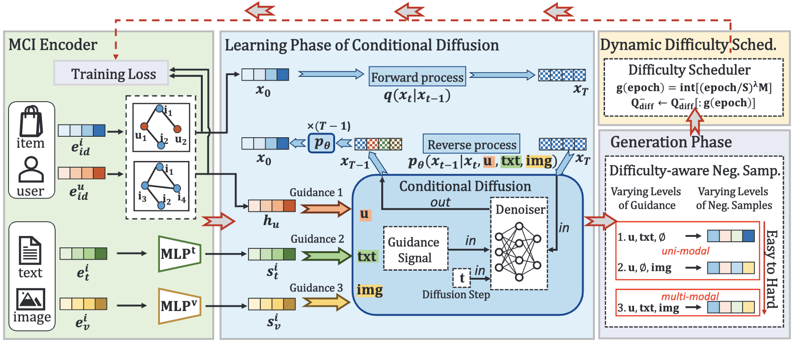| [Link](https://dl.acm.org/doi/epdf/10.1145/3726302.3729986)|
|Generating with fairness: A modality-diffused counterfactual framework for incomplete multimodal recommendations | WWW 2025 |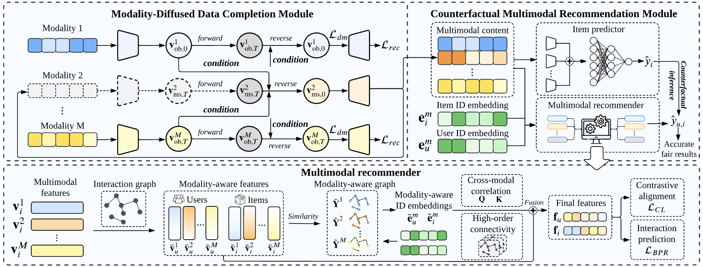| [Link](https://dl.acm.org/doi/epdf/10.1145/3696410.3714606)|
|Flip is Better than Noise: Unbiased Interest Generation for Multimedia Recommendation | MM 2025 |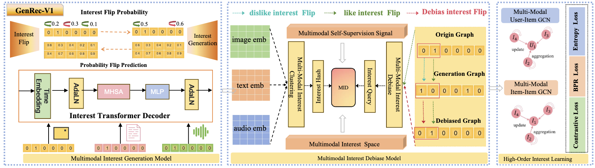| [Link](https://dl.acm.org/doi/epdf/10.1145/3746027.3755743)|
|Boosting Guided Diffusion with Large Language Models for Multimodal Sequential Recommendation | MM 2025 |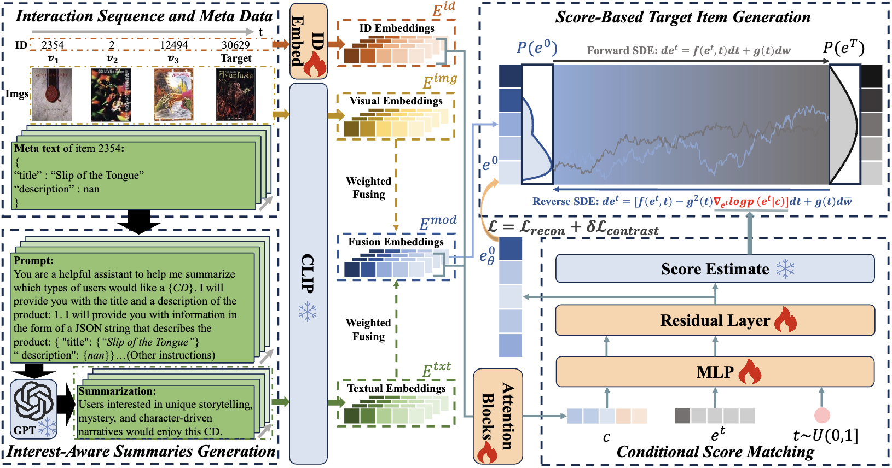| [Link](https://dl.acm.org/doi/epdf/10.1145/3746027.3755544)|
|Diffusion-based multi-modal synergy interest network for click-through rate prediction | SIGIR 2025 |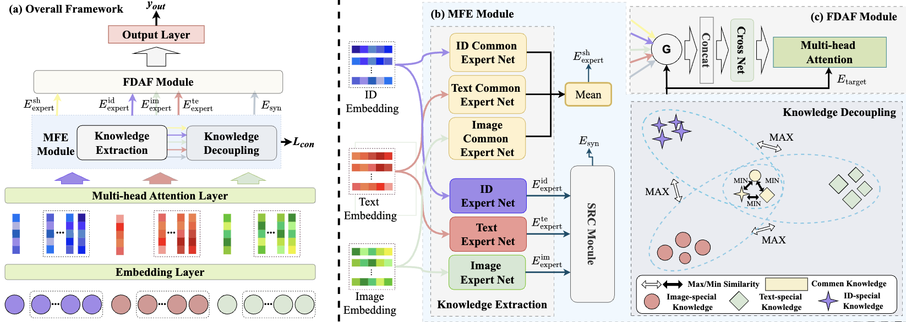| [Link](https://dl.acm.org/doi/epdf/10.1145/3726302.3729949)|
|Dual-layer cross-modal alignment recommendation based on the diffusion model | Info Fusion 2026 || [Link](https://www.sciencedirect.com/science/article/pii/S1566253525005457)|
|Asymmetric Diffusion Recommendation Model | CIKM 2025 |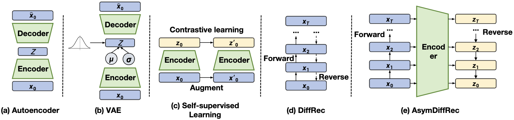| [Link](https://dl.acm.org/doi/epdf/10.1145/3746252.3760833)|

- #### **Cross-domain Recommendation**
  
|Title | Venue | Main Image | Paper|
| :--- | :--: | :---: | :---: |
|Diffusion Cross-domain Recommendation | Arxiv 2024 |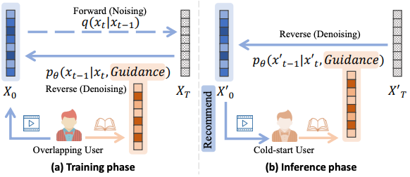| [Link](https://arxiv.org/abs/2402.02182)|
|Diff-MSR: A Diffusion Model Enhanced Paradigm for Cold-Start Multi-Scenario Recommendation | WSDM 2024 |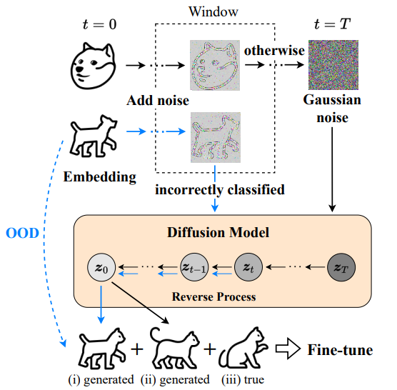| [Link](https://dl.acm.org/doi/10.1145/3616855.3635807)|
|Exploring Preference-Guided Diffusion Model for Cross-Domain Recommendation | KDD 2025 |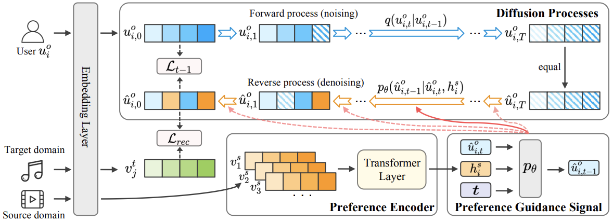| [Link](https://arxiv.org/abs/2501.11671)|
|LLM-Grounded Diffusion for Cross-Domain Recommendation | MM 2025 |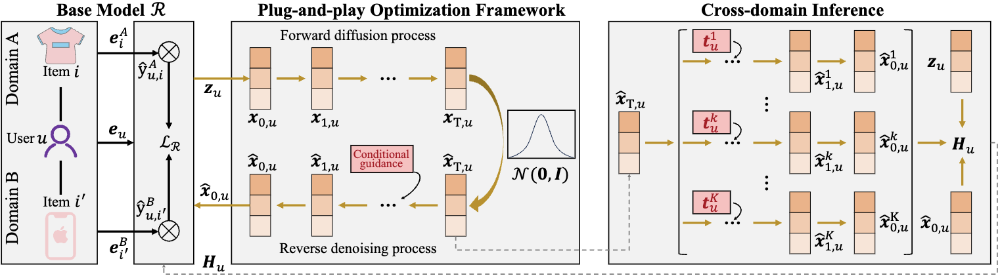| [Link](https://dl.acm.org/doi/epdf/10.1145/3746027.3755347)|
| Align-for-Fusion: Harmonizing Triple Preferences via Dual-oriented Diffusion for Cross-domain Sequential Recommendation | Arxiv 2025 |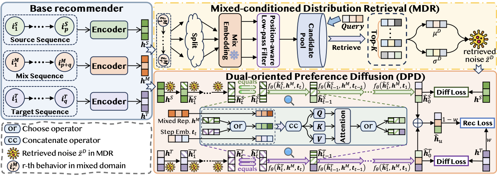| [Link](https://arxiv.org/pdf/2508.05074)|
|Diffusion Alignment for Cross Domain Recommendation | ICMR 2025 |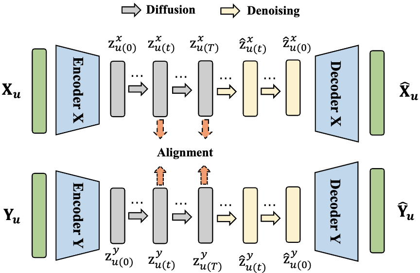| [Link](https://dl.acm.org/doi/epdf/10.1145/3731715.3733307)|
|CD-CDR: Conditional Diffusion-based Item Generation for Cross-Domain Recommendation | SIGIR 2025 |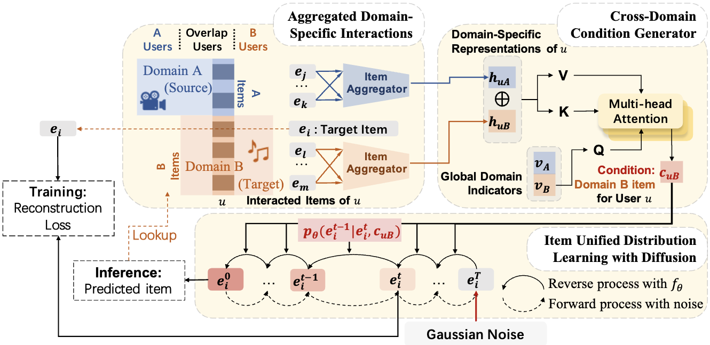| [Link](https://dl.acm.org/doi/epdf/10.1145/3726302.3729918)|

---

### Trustworthy Objectives and Constraints

<p align="center">
  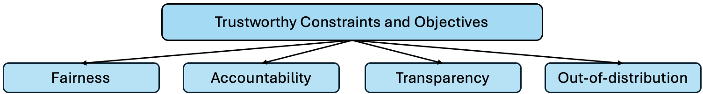
</p>

- #### **Fairness**

|Title | Venue | Main Image | Paper|
| :--- | :--: | :---: | :---: |
|Balancing User Preferences by Social Networks: A Condition-Guided Social Recommendation Model for Mitigating Popularity Bias | NN 2025 |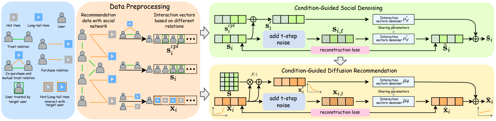| [Link](https://arxiv.org/abs/2405.16772)|
|Controlling Diversity at Inference: Guiding Diffusion Recommender Models with Targeted Category Preferences | Arxiv 2024 |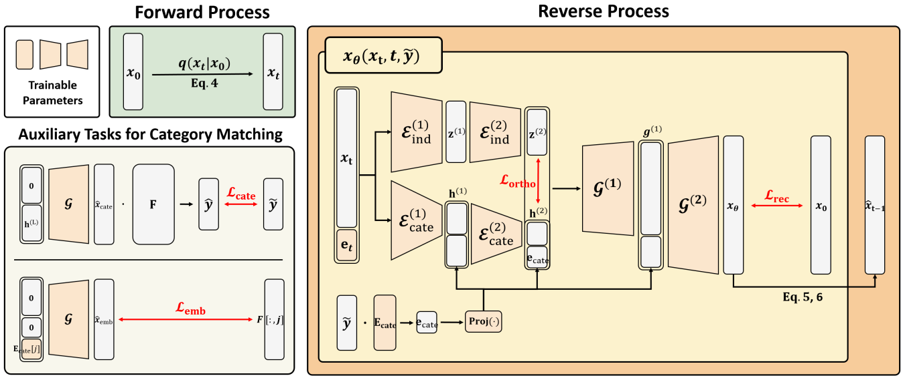| [Link](https://arxiv.org/abs/2411.11240)|
|Guided Diffusion-based Counterfactual Augmentation for Robust Session-based Recommendation | Arxiv 2024 |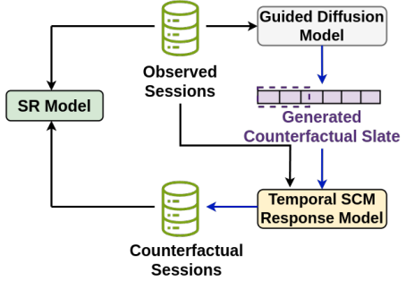| [Link](https://arxiv.org/abs/2410.21892)|
|DifFaiRec: Generative Fair Recommender with Conditional Diffusion Model | Arxiv 2024 |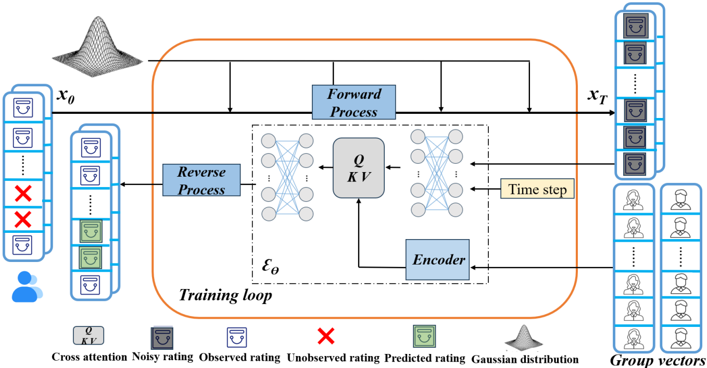| [Link](https://arxiv.org/abs/2410.02791)|
|How Fair is Your Diffusion Recommender Model? | Arxiv 2024 |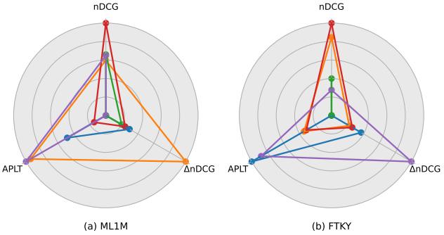| [Link](https://arxiv.org/abs/2409.04339)|
| Bridging Interests and Truth: Towards Mitigating Fake News with Personalized and Truthful Recommendations | SIGIR 2025 |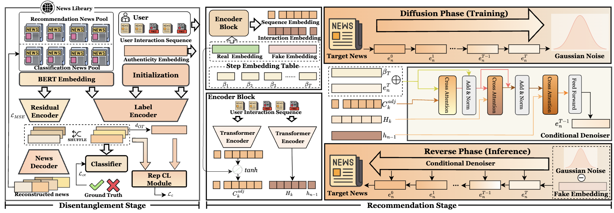| [Link](https://dl.acm.org/doi/epdf/10.1145/3726302.3729912)|
|FairCDR: transferring fairness and user preferences for cross-domain recommendation | KDD 2025 |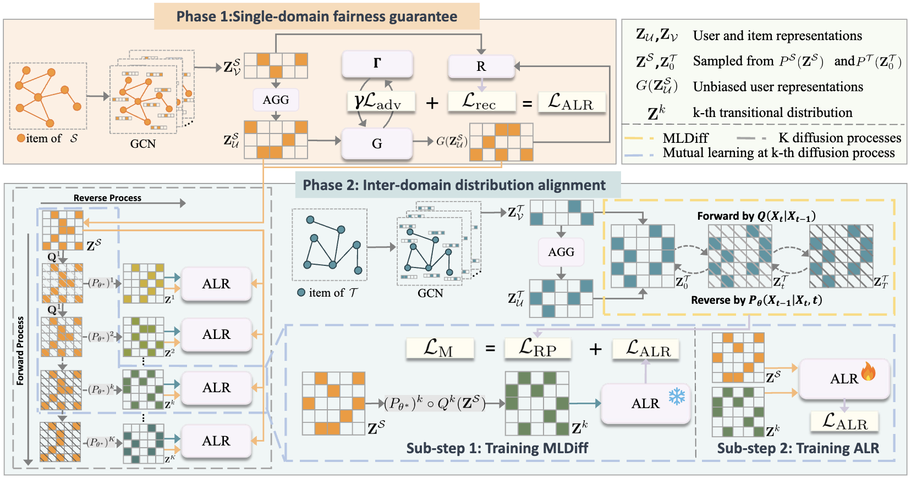| [Link](https://dl.acm.org/doi/epdf/10.1145/3711896.3736951)|
|Adversarial regularized diffusion model for fair recommendation | NN 2025 | | [Link](https://www.sciencedirect.com/science/article/abs/pii/S0893608025005751)|
|Alleviating User-Sensitive Bias with Fair Generative Sequential Recommendation Model | ICIC 2025 || [Link](https://link.springer.com/chapter/10.1007/978-981-96-9881-3_19)|

- #### **Accountability**

|Title | Venue | Main Image | Paper|
| :--- | :--: | :---: | :---: |
|Manipulating Visually Aware Federated Recommender Systems and Its Countermeasures | TOIS 2023 |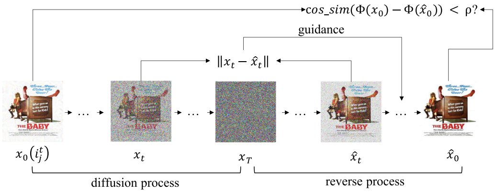| [Link](https://dl.acm.org/doi/10.1145/3630005)|
|Adversarial Item Promotion on Visually-Aware Recommender Systems by Guided Diffusion | TOIS 2024 |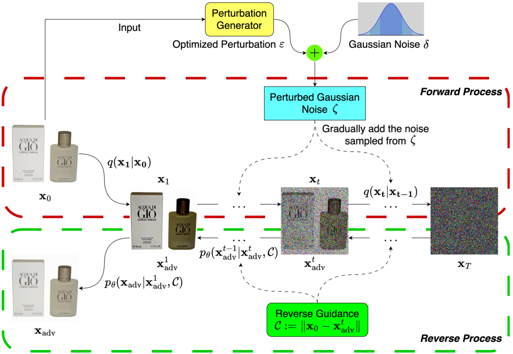| [Link](https://dl.acm.org/doi/10.1145/3666088)|
|Generating Model Parameters for Controlling: Parameter Diffusion for Controllable Multi-Task Recommendation | Arxiv 2024 |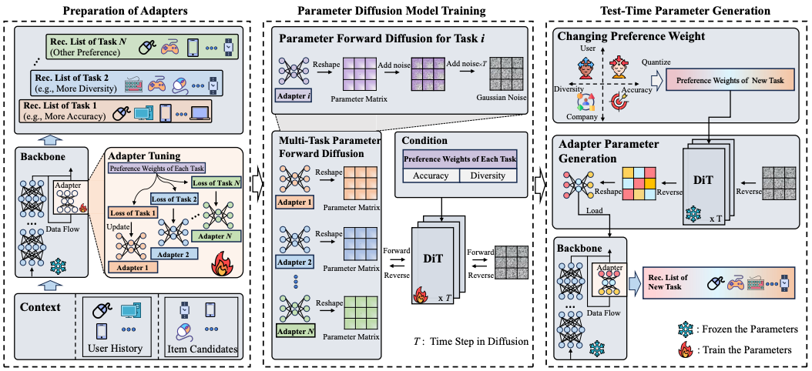| [Link](https://arxiv.org/abs/2410.10639)|
|Multi-Resolution Diffusion for Privacy-Sensitive Recommender Systems | Access 2024 |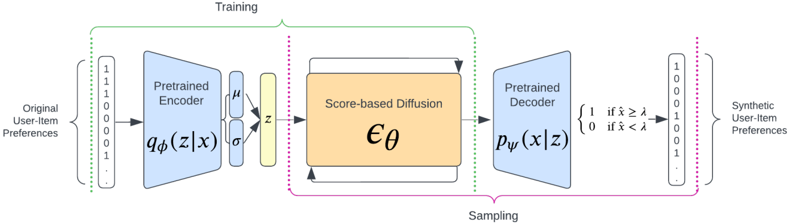| [Link](https://arxiv.org/abs/2311.03488)|
|ToDA: Target-oriented Diffusion Attacker against Recommendation System | Arxiv 2024 |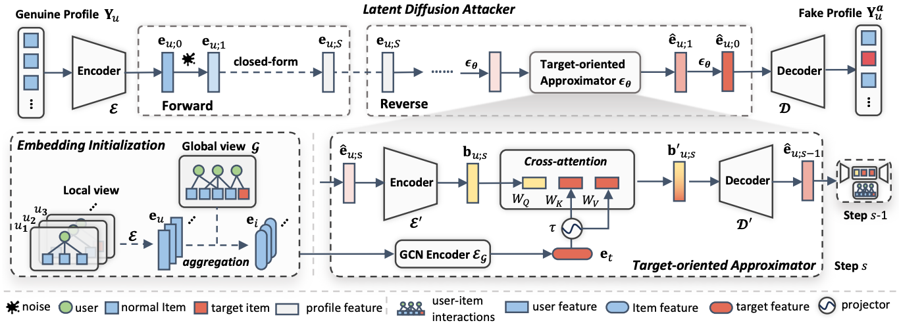| [Link](https://arxiv.org/abs/2401.12578)|
|Federated Recommender System Based on Diffusion Augmentation and Guided Denoising | TOIS 2024 |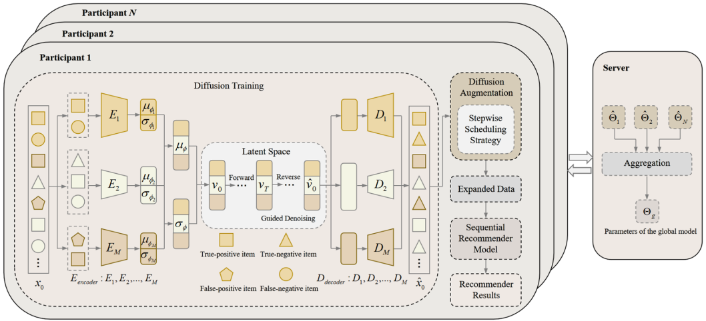| [Link](https://dl.acm.org/doi/10.1145/3688570)|
|Latent diffusion model-based data poisoning attack against QoS-aware cloud API recommender system | Computer Networks 2025 | | [Link](https://www.sciencedirect.com/science/article/abs/pii/S138912862500088X)|
|FedDiffRec: A Module-wise Training Approach for Diffusion-Based Recommendation in Federated Learning | ICASSP 2025 |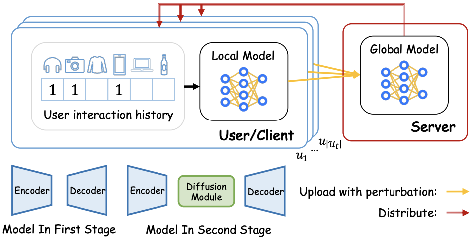| [Link](https://ieeexplore.ieee.org/document/10889647)|
|An Adversarial Model with Diffusion for Robust Recommendation against Shilling Attack| SAC 2025 |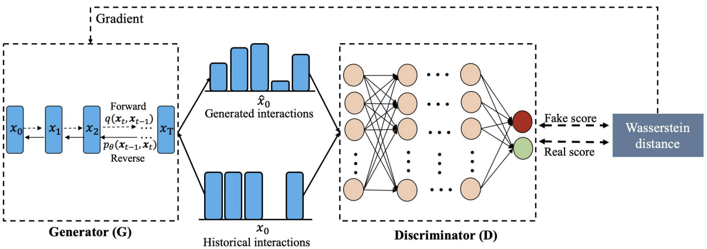| [Link](https://dl.acm.org/doi/10.1145/3672608.3707821)|
|Controllable and Stealthy Shilling Attacks via Dispersive Latent Diffusion| Arxiv 2025 |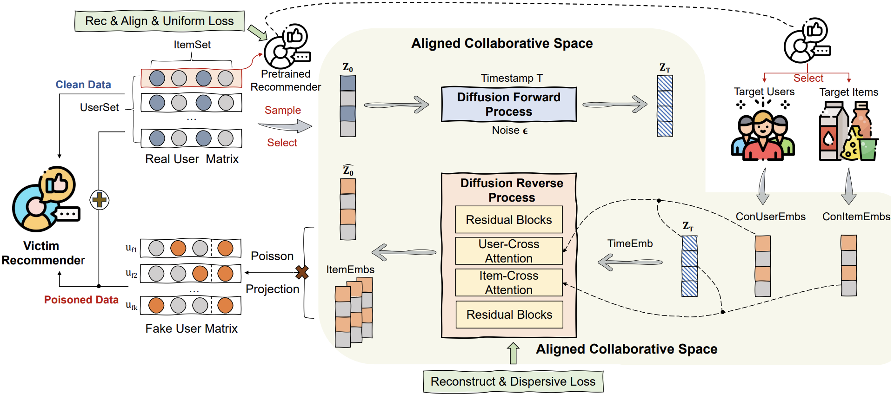| [Link](https://arxiv.org/pdf/2508.01987)|

-  #### **Transparency**

|Title | Venue | Main Image | Paper|
| :--- | :--: | :---: | :---: |
|An Explainable Recommendation Method based on Diffusion Model | BigDIA 2023 |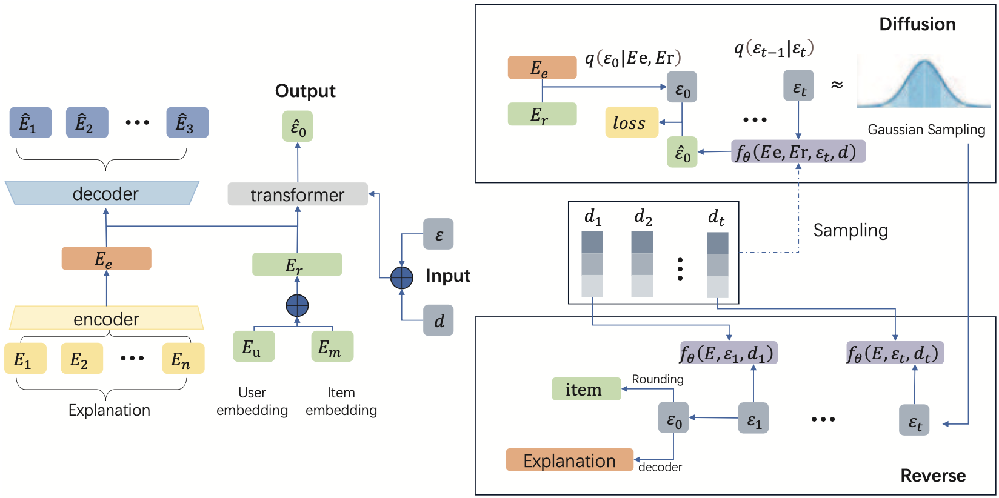| [Link](https://ieeexplore.ieee.org/document/10429319)|

- #### **Out-of-distribution**

|Title | Venue | Main Image | Paper|
| :--- | :--: | :---: | :---: |
|Graph Representation Learning via Causal Diffusion for Out-of-Distribution Recommendation | WWW 2025 || [Link](https://arxiv.org/abs/2408.00490)|
|Distributionally robust graph out-of-distribution recommendation via diffusion model | WWW 2025 || [Link](https://arxiv.org/abs/2501.15555)|
|A Distributed Robust Out-of-Distribution Consumer Recommendation System Using Diffusion Model | TCE 2025 || [Link](https://ieeexplore.ieee.org/document/11215749)|
| Causal Negative Sampling via Diffusion Model for Out-of-Distribution Recommendation | Arxiv 2025 || [Link](https://arxiv.org/pdf/2508.07243)|
