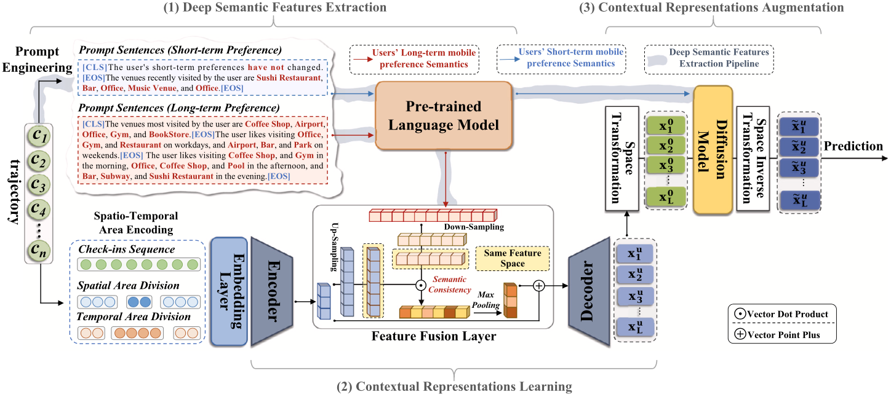

# Diffusion Models In Recommendation Systems

A survey of diffusion models in recommendation systems.


Detailed information can be found in our [survey paper](https://arxiv.org/pdf/2501.10548).

```Bibtex
@article{wei2025diffusion,
  title={Diffusion Models in Recommendation Systems: A Survey},
  author={Wei, Ting-Ruen and Fang, Yi},
  journal={arXiv preprint arXiv:2501.10548},
  year={2025}
}
```
## Table of Contents
- [Background in Diffusion Models](#background-in-diffusion-models)
- [Papers for Diffusion Models in Recsys](#papers-for-diffusion-models-in-recsys)
  -   [Collaborative Filtering](#collaborative-filtering)
  -   [Sequential Recommendation](#sequential-recommendation)
  -   [Multi-domain Recommendation](#multi-domain-recommendation)
  -   [Responsible Recommendation](#responsible-recommendation)

---

### Background in Diffusion Models
- [Deep Unsupervised Learning using Nonequilibrium Thermodynamics](https://arxiv.org/abs/1503.03585)
- [Generative Modeling by Estimating Gradients of the Data Distribution](https://arxiv.org/abs/1907.05600)
- [Denoising Diffusion Probabilistic Models](https://arxiv.org/abs/2006.11239)
- [Score-Based Generative Modeling through Stochastic Differential Equations](https://arxiv.org/abs/2011.13456)
- [Improved Denoising Diffusion Probabilistic Models](https://arxiv.org/abs/2102.09672)
- [Diffusion Models Beat GANs on Image Synthesis](https://arxiv.org/abs/2105.05233)
- [Classifier-Free Diffusion Guidance](https://arxiv.org/abs/2207.12598)
- [High-Resolution Image Synthesis with Latent Diffusion Models](https://arxiv.org/abs/2112.10752)
- [Progressive Distillation for Fast Sampling of Diffusion Models](https://arxiv.org/abs/2202.00512)

---

### Papers for Diffusion Models in Recsys

### Collaborative Filtering

- **Implicit Feedback**

|Title | Venue | Main Image | Paper|
| :--- | :--: | :---: | :---: |
|Blurring-sharpening process models for collaborative filtering| SIGIR 2023 |  | [Link](https://arxiv.org/abs/2211.09324)|
|Incorporating Classifier-Free Guidance in Diffusion Model-Based Recommendation | Arxiv 2024 |  | [Link](https://arxiv.org/abs/2409.10494)|
|Collaborative Filtering Based on Diffusion Models: Unveiling the Potential of High-Order Connectivity | SIGIR 2024 |  | [Link](https://arxiv.org/abs/2404.14240)|
|Recommendation via collaborative diffusion generative model | KSEM 2022 |  | [Link](https://link.springer.com/chapter/10.1007/978-3-031-10989-8_47)|
|Denoising diffusion recommender model | SIGIR 2024 |  | [Link](https://arxiv.org/abs/2401.06982)|
|A Directional Diffusion Graph Transformer for Recommendation | Arxiv 2024 |  | [Link](https://arxiv.org/abs/2404.03326)|
|Diffusion recommender model | SIGIR 2023 |  | [Link](https://arxiv.org/abs/2304.04971)|
|Recfusion: A binomial diffusion process for 1d data for recommendation | Arxiv 2023 |  | [Link](https://arxiv.org/abs/2306.08947)|
|SCONE: A Novel Stochastic Sampling to Generate Contrastive Views and Hard Negative Samples for Recommendation | WSDM 2025 |  | [Link](https://arxiv.org/abs/2405.00287)|
|Effects of Using Synthetic Data on Deep Recommender Models' Performance | Arxiv 2024 |  | [Link](https://arxiv.org/abs/2406.18286)|
|GDDRec: graph neural diffusion model for diversified recommendation | KIS 2025 |  | [Link](https://link.springer.com/article/10.1007/s10115-025-02348-y)|
|Collaborative Diffusion Model for Recommender System | WWW 2025 |  | [Link](https://arxiv.org/abs/2501.18997)|
|Hyperbolic Diffusion Recommender Model | WWW 2025 |  | [Link](https://arxiv.org/abs/2504.01541)|
|Conditional diffusion model for recommender systems | NN 2025 |  | [Link](https://www.sciencedirect.com/science/article/pii/S0893608025000838)|
|Generative Recommendation with Continuous-Token Diffusion | Arxiv 2025 |  | [Link](https://arxiv.org/abs/2504.12007)|
|Diffusion Model as a Base for Cold Item Recommendation | Applied Sciences 2025 |  | [Link](https://www.mdpi.com/2076-3417/15/9/4784)|
|Diff-GNDCRec: A diffusion model with graph-node enhancement and difference comparison for recommendation | IPM 2025 |  | [Link](https://www.sciencedirect.com/science/article/abs/pii/S0306457325000950?dgcid=rss_sd_all)|
|A Diffusion Model with User Preference Guidance for Recommendation | DASFAA 2024 |  | [Link](https://link.springer.com/chapter/10.1007/978-981-97-5555-4_15)|
|Graph-based Diffusion Model for Collaborative Filtering | Arxiv 2025 |  | [Link](https://arxiv.org/abs/2504.05029)|
|DiffGCL: Diffusion model-based Graph Contrastive Learning for Service Recommendation | ICWS 2024 |  | [Link](https://ieeexplore.ieee.org/document/10707576)|
|Divide-and-Conquer: Cold-Start Bundle Recommendation via Mixture of Diffusion Experts | Arxiv 2025 |  | [Link](https://arxiv.org/abs/2505.05035)|
|DiffGraph: Heterogeneous Graph Diffusion Model | WSDM 2025 |  | [Link](https://arxiv.org/abs/2501.02313)|
|Diffusion-driven SpatioTemporal Graph KANsformer for Medical Examination Recommendation | Arxiv 2025 |  | [Link](https://arxiv.org/abs/2505.07431)|
|DiffGR: A Discrete Diffusion-Based Model for Personalised Recommendation by Reconstructing User-Item Bipartite Graphs | ECIR 2025 |  | [Link](https://link.springer.com/chapter/10.1007/978-3-031-88714-7_23)|
|GGDHSCL: A Graph Generative Diffusion With Hard Negative Sampling Contrastive Learning Recommendation Method | TCSS 2025 |  | [Link](https://ieeexplore.ieee.org/document/10904007)|
|Personalized Diffusion Model Reshapes Cold-Start Bundle Recommendation | WWW 2025 |  | [Link](https://arxiv.org/abs/2505.14901)|
|Addressing Cold-Start Problem in Click-Through Rate Prediction via Supervised Diffusion Modeling | AAAI 2025 |  | [Link](https://arxiv.org/abs/2504.06270)|

- **Explicit Rating**
  
|Title | Venue | Main Image | Paper|
| :--- | :--: | :---: | :---: |
|DGRM: Diffusion-GAN recommendation model to alleviate the mode collapse problem in sparse environments | Pattern Recognition 2024 |  | [Link](https://www.sciencedirect.com/science/article/abs/pii/S0031320324004436)|
|EDGE-Rec: Efficient and Data-Guided Edge Diffusion For Recommender Systems Graphs | Arxiv 2024 | | [Link](https://arxiv.org/abs/2409.14689)|

- **Item Graph**

|Title | Venue | Main Image | Paper|
| :--- | :--: | :---: | :---: |
|DICES: Diffusion-Based Contrastive Learning with Knowledge Graphs for Recommendation | KSEM 2024 | | [Link](https://link.springer.com/chapter/10.1007/978-981-97-5495-3_9)|
|Diffkg: Knowledge graph diffusion model for recommendation | WSDM 2024 | | [Link](https://arxiv.org/abs/2312.16890)|
|G-Diff: A Graph-Based Decoding Network for Diffusion Recommender Model | TNNLS 2024 |  | [Link](https://ieeexplore.ieee.org/document/10750895)|
|Graph Signal Diffusion Model for Collaborative Filtering | SIGIR 2024 | | [Link](https://arxiv.org/abs/2311.08744)|

- **User Graph**

|Title | Venue | Main Image | Paper|
| :--- | :--: | :---: | :---: |
|Diffusion social augmentation for social recommendation | Supercomputing 2025 | | [Link](https://link.springer.com/article/10.1007/s11227-024-06695-5)|
|Recdiff: diffusion model for social recommendation | CIKM 2024 | | [Link](https://arxiv.org/abs/2406.01629)|

---

### Sequential Recommendation

- **Point-of-interest**

|Title | Venue | Main Image | Paper|
| :--- | :--: | :---: | :---: |
|Diffusion-based cloud-edge-device collaborative learning for next POI recommendations | KDD 2024 || [Link](https://arxiv.org/abs/2405.13811)|
|Diff-DGMN: A Diffusion-Based Dual Graph Multi-Attention Network for POI Recommendation | IoT 2024 || [Link](https://ieeexplore.ieee.org/document/10640103)|
|A diffusion model for poi recommendation | TOIS 2023 || [Link](https://arxiv.org/abs/2304.07041)|
|DSDRec: Next POI recommendation using deep semantic extraction and diffusion model | Info Sci 2024 || [Link](https://www.sciencedirect.com/science/article/abs/pii/S0020025524009186)|

- **Sequence as Diffusion Target and Guidance**
  
|Title | Venue | Main Image | Paper|
| :--- | :--: | :---: | :---: |
|Context Matters: Enhancing Sequential Recommendation with Context-aware Diffusion-based Contrastive Learning | CIKM 2024 || [Link](https://arxiv.org/abs/2405.09369)|
|Dual Conditional Diffusion Models for Sequential Recommendation | Arxiv 2024 || [Link](https://arxiv.org/abs/2410.21967)|
|Semantic-Aware Diffusion Model for Sequential Recommendation | Open Review 2024 || [Link](https://openreview.net/forum?id=2E6OK8cSoB)|

- **Sequence as Diffusion Target**

|Title | Venue | Main Image | Paper|
| :--- | :--: | :---: | :---: |
|Discrete conditional diffusion for reranking in recommendation | WWW 2024 || [Link](https://dl.acm.org/doi/10.1145/3589335.3648313)|
|Breaking Determinism: Fuzzy Modeling of Sequential Recommendation Using Discrete State Space Diffusion Model | NeurIPS 2024 || [Link](https://arxiv.org/abs/2410.23994)|
|A Diffusion Data Enhancement Retentive Model for Sequential Recommendation | CISAT 2024 || [Link](https://ieeexplore.ieee.org/abstract/document/10695308)|
|Diff4rec: Sequential recommendation with curriculum-scheduled diffusion augmentation | MM 2023 || [Link](https://dl.acm.org/doi/10.1145/3581783.3612709)|
|Diffusion augmentation for sequential recommendation | CIKM 2023 || [Link](https://arxiv.org/abs/2309.12858)|
|Multi-Interest Network with Simple Diffusion for Multi-Behavior Sequential Recommendation | SDM 2024 || [Link](https://epubs.siam.org/doi/10.1137/1.9781611978032.84)|
|Plug-in diffusion model for sequential recommendation | AAAI 2024 || [Link](https://arxiv.org/abs/2401.02913)|
|SeeDRec: Sememe-based Diffusion for Sequential Recommendation | IJCAI 2024 || [Link](https://www.ijcai.org/proceedings/2024/251)|
|Bridging User Dynamics: Transforming Sequential Recommendations with Schr{\"o}dinger Bridge and Diffusion Models | CIKM 2024 || [Link](https://arxiv.org/abs/2409.10522)|

- **Sequence as Diffusion Guidance**

|Title | Venue | Main Image | Paper|
| :--- | :--: | :---: | :---: |
|Conditional denoising diffusion for sequential recommendation | PAKDD 2024 || [Link](https://arxiv.org/abs/2304.11433)|
|Sequential recommendation with diffusion models | Arxiv 2023 || [Link](https://arxiv.org/abs/2304.04541)|
|Diffusion Recommendation with Implicit Sequence Influence | WWW 2024 || [Link](https://dl.acm.org/doi/10.1145/3589335.3651951)|
|Diffurec: A diffusion model for sequential recommendation | TOIS 2023 || [Link](https://dl.acm.org/doi/10.1145/3631116)|
|DimeRec: A Unified Framework for Enhanced Sequential Recommendation via Generative Diffusion Models | WSDM 2025 || [Link](https://arxiv.org/abs/2408.12153)|
|Generate what you prefer: Reshaping sequential recommendation via guided diffusion | NeurIPS 2024 || [Link](https://arxiv.org/abs/2310.20453)|
|EDiffuRec: An Enhanced Diffusion Model for Sequential Recommendation | Mathematics 2024 || [Link](https://www.mdpi.com/2227-7390/12/12/1795)|
|Generate and Instantiate What You Prefer: Text-Guided Diffusion for Sequential Recommendation | Arxiv 2024 || [Link](https://arxiv.org/abs/2410.13428)|
|Implicit local--global feature extraction for diffusion sequence recommendation | EAAI 2025 || [Link](https://www.sciencedirect.com/science/article/abs/pii/S0952197624016294)|
|LeadRec: Towards Personalized Sequential Recommendation via Guided Diffusion | ICIC 2024 || [Link](https://link.springer.com/chapter/10.1007/978-981-97-5618-6_1)|
|Preference Diffusion for Recommendation | Arxiv 2024 || [Link](https://arxiv.org/abs/2410.13117)|

---

### Multi-domain Recommendation

- **Image Generation**

|Title | Venue | Main Image | Paper|
| :--- | :--: | :---: | :---: |
|AdBooster: Personalized Ad Creative Generation using Stable Diffusion Outpainting | Recsys 2023 || [Link](https://arxiv.org/abs/2309.11507)|
|A New Creative Generation Pipeline for Click-Through Rate with Stable Diffusion Model | WWW 2024 || [Link](https://arxiv.org/abs/2401.10934)|
|Dynamic Product Image Generation and Recommendation at Scale for Personalized E-commerce | Recsys 2024 || [Link](https://arxiv.org/abs/2408.12392)|
|Diffusion Models for Generative Outfit Recommendation | SIGIR 2024 || [Link](https://arxiv.org/abs/2402.17279)|
|GEMRec: Towards Generative Model Recommendation | WSDM 2024 || [Link](https://arxiv.org/abs/2308.02205)|

- **Text-to-recommendation**

|Title | Venue | Main Image | Paper|
| :--- | :--: | :---: | :---: |
|Diffusion Model for Slate Recommendation | Arxiv 2024 || [Link](https://arxiv.org/abs/2408.06883)|

- **Multi-modal Attributes**

|Title | Venue | Main Image | Paper|
| :--- | :--: | :---: | :---: |
|DiffMM: Multi-Modal Diffusion Model for Recommendation | MM 2024 || [Link](https://arxiv.org/abs/2406.11781)|
|LD4MRec: Simplifying and Powering Diffusion Model for Multimedia Recommendation | Arxiv 2023 || [Link](https://arxiv.org/abs/2309.15363)|
|Multimodal Conditioned Diffusion Model for Recommendation | WWW 2024 || [Link](https://dl.acm.org/doi/10.1145/3589335.3651956)|
|Diffusion Review-Based Recommendation | KSEM 2024 || [Link](https://link.springer.com/chapter/10.1007/978-981-97-5489-2_23)|

- **Cross-domain**
  
|Title | Venue | Main Image | Paper|
| :--- | :--: | :---: | :---: |
|Diffusion Cross-domain Recommendation | Arxiv 2024 || [Link](https://arxiv.org/abs/2402.02182)|
|Diff-MSR: A Diffusion Model Enhanced Paradigm for Cold-Start Multi-Scenario Recommendation | WSDM 2024 || [Link](https://dl.acm.org/doi/10.1145/3616855.3635807)|

---

### Responsible Recommendation

- **Fairness**

|Title | Venue | Main Image | Paper|
| :--- | :--: | :---: | :---: |
|Balancing User Preferences by Social Networks: A Condition-Guided Social Recommendation Model for Mitigating Popularity Bias | NN 2025 || [Link](https://arxiv.org/abs/2405.16772)|
|Controlling Diversity at Inference: Guiding Diffusion Recommender Models with Targeted Category Preferences | Arxiv 2024 || [Link](https://arxiv.org/abs/2411.11240)|
|Guided Diffusion-based Counterfactual Augmentation for Robust Session-based Recommendation | Arxiv 2024 || [Link](https://arxiv.org/abs/2410.21892)|
|DifFaiRec: Generative Fair Recommender with Conditional Diffusion Model | Arxiv 2024 || [Link](https://arxiv.org/abs/2410.02791)|
|How Fair is Your Diffusion Recommender Model? | Arxiv 2024 || [Link](https://arxiv.org/abs/2409.04339)|

- **Accountability**

|Title | Venue | Main Image | Paper|
| :--- | :--: | :---: | :---: |
|Manipulating Visually Aware Federated Recommender Systems and Its Countermeasures | TOIS 2023 || [Link](https://dl.acm.org/doi/10.1145/3630005)|
|Adversarial Item Promotion on Visually-Aware Recommender Systems by Guided Diffusion | TOIS 2024 || [Link](https://dl.acm.org/doi/10.1145/3666088)|
|Generating Model Parameters for Controlling: Parameter Diffusion for Controllable Multi-Task Recommendation | Arxiv 2024 || [Link](https://arxiv.org/abs/2410.10639)|
|Multi-Resolution Diffusion for Privacy-Sensitive Recommender Systems | Access 2024 || [Link](https://arxiv.org/abs/2311.03488)|
|ToDA: Target-oriented Diffusion Attacker against Recommendation System | Arxiv 2024 || [Link](https://arxiv.org/abs/2401.12578)|
|Federated Recommender System Based on Diffusion Augmentation and Guided Denoising | TOIS 2024 || [Link](https://dl.acm.org/doi/10.1145/3688570)|

-  **Transparency**

|Title | Venue | Main Image | Paper|
| :--- | :--: | :---: | :---: |
|An Explainable Recommendation Method based on Diffusion Model | BigDIA 2023 || [Link](https://ieeexplore.ieee.org/document/10429319)|

- **Out-of-distribution**

|Title | Venue | Main Image | Paper|
| :--- | :--: | :---: | :---: |
|Graph Representation Learning via Causal Diffusion for Out-of-Distribution Recommendation | WWW 2025 || [Link](https://arxiv.org/abs/2408.00490)|
